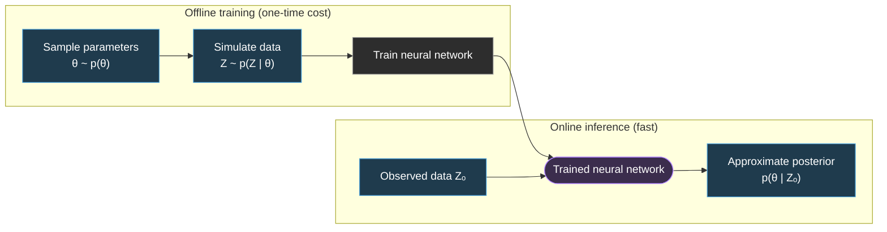

# NeuralEstimators 

[![][docs-dev-img]][docs-dev-url]
[](https://github.com/msainsburydale/NeuralEstimators.jl/actions/workflows/CI.yml)
[](https://app.codecov.io/gh/msainsburydale/NeuralEstimators.jl)

[docs-dev-img]: https://img.shields.io/badge/docs-dev-blue.svg
[docs-dev-url]: https://msainsburydale.github.io/NeuralEstimators.jl/dev/

[R-repo-img]: https://img.shields.io/badge/R-interface-blue.svg
[R-repo-url]: https://github.com/msainsburydale/NeuralEstimators

`NeuralEstimators` is a Julia package for **fast**, **simulation-based** inference using neural networks. It is designed for settings where likelihoods are intractable or classical methods such as MCMC are computationally expensive. The package supports: 

- Neural posterior estimation (NPE): directly learn the posterior distribution
- Neural ratio estimation (NRE): approximate likelihood ratios for flexible frequentist or Bayesian inference
- Neural Bayes estimation (NBE): efficiently estimate functionals (point summaries) of the posterior distribution

These methods are **likelihood-free** and **amortized**: once the neural networks are trained on simulated data, they enable rapid inference across arbitrarily many observed data sets **orders of magnitude faster** than conventional approaches.

See the [documentation](https://msainsburydale.github.io/NeuralEstimators.jl/dev/) to get started.

### Overview



### Backends

The package supports neural networks defined with either of the two leading deep-learning packages in Julia, namely [Flux.jl](https://fluxml.ai) or [Lux.jl](https://lux.csail.mit.edu).

### Installation 

Please first install the current stable release of [Julia](https://julialang.org/downloads/). Then, install the current stable version of the package using the following command inside Julia:

```julia
using Pkg; Pkg.add("NeuralEstimators")
```

Or install the current development version using the command:

```julia
using Pkg; Pkg.add(url = "https://github.com/msainsburydale/NeuralEstimators.jl")
```

### Quick start

The following code constructs an NBE for parameters $\boldsymbol{\theta} \equiv (\mu, \sigma)'$ from data $\boldsymbol{Z} \equiv (Z_1, \dots, Z_n)'$, where each $Z_i \overset{\mathrm{iid}}\sim N(\mu, \sigma^2)$. 

```julia
using NeuralEstimators
using Flux

# Dimension of θ and number of replicates
d, n = 2, 100  

# Functions to sample from prior p(θ) and simulate data p(Z|θ)
sampler(K) = NamedMatrix(μ = randn(K), σ = rand(K))
simulator(θ::AbstractVector) = θ["μ"] .+ θ["σ"] .* sort(randn(n))
simulator(θ::AbstractMatrix) = reduce(hcat, map(simulator, eachcol(θ)))

# Neural network, an MLP mapping n inputs into d outputs
network = Chain(Dense(n, 64, gelu), Dense(64, 64, gelu), Dense(64, d))

# Initialise an NBE
estimator = PointEstimator(network)

# Train the estimator
estimator = train(estimator, sampler, simulator)

# Apply to observed data
Z = simulator(sampler(1))  # stand-in for real observations
estimate(estimator, Z)     # point estimate
```


### R interface

A convenient interface for `R` users is available on [CRAN](https://CRAN.R-project.org/package=NeuralEstimators).

### Contributing

We welcome contributions of all sizes. To get started, see [CONTRIBUTING.md](https://github.com/msainsburydale/NeuralEstimators.jl?tab=contributing-ov-file) for an overview of the code structure, development workflow, and how to submit contributions. A list of planned improvements is available in [TODO.md](https://github.com/msainsburydale/NeuralEstimators.jl/blob/main/TODO.md), and instructions for contributing to the documentation can be found in [docs/README.md](https://github.com/msainsburydale/NeuralEstimators.jl/blob/main/docs/README.md).

If you encounter a bug or have a suggestion, please feel free to [open an issue](https://github.com/msainsburydale/NeuralEstimators.jl/issues) or submit a pull request.

### Supporting and citing

This software was developed as part of academic research. If you would like to support it, please star the repository. If you use it in your research or other activities, please also use the following citation.

```
@misc{,
  title = {{NeuralEstimators.jl}: A {J}ulia package for efficient simulation-based inference using neural networks},
  author = {Sainsbury-Dale, Matthew},
  year = {2026},
  note = {Version 0.2.0},
  howpublished = {\url{https://github.com/msainsburydale/NeuralEstimators.jl}}
}

@article{,
    title = {Likelihood-Free Parameter Estimation with Neural {B}ayes Estimators},
    author = {Matthew Sainsbury-Dale and Andrew Zammit-Mangion and Raphael Huser},
    journal = {The American Statistician},
    year = {2024},
    volume = {78},
    pages = {1--14},
    doi = {10.1080/00031305.2023.2249522},
  }
```

### Papers using NeuralEstimators

- **Likelihood-free parameter estimation with neural Bayes estimators** [[paper]](https://doi.org/10.1080/00031305.2023.2249522) [[code]](https://github.com/msainsburydale/NeuralBayesEstimators)

- **Neural methods for amortized inference** [[paper]](https://doi.org/10.1146/annurev-statistics-112723-034123)[[code]](https://github.com/andrewzm/Amortised_Neural_Inference_Review)

- **Neural Bayes estimators for irregular spatial data using graph neural networks** [[paper]](https://doi.org/10.1080/10618600.2024.2433671)[[code]](https://github.com/msainsburydale/NeuralEstimatorsGNN)

- **Neural Bayes estimators for censored inference with peaks-over-threshold models** [[paper]](https://jmlr.org/papers/v25/23-1134.html) [[code]](https://github.com/Jbrich95/CensoredNeuralEstimators)

- **Neural parameter estimation with incomplete data** [[paper]](https://arxiv.org/abs/2501.04330)[[code]](https://github.com/msainsburydale/NeuralIncompleteData)

- **Neural Bayes inference for complex bivariate extremal dependence models** [[paper]](https://arxiv.org/abs/2503.23156)[[code]]( https://github.com/lidiamandre/NBE_classifier_depmodels)

- **Fast likelihood-free parameter estimation for Lévy processes** [[paper]](https://www.arxiv.org/abs/2505.01639)
