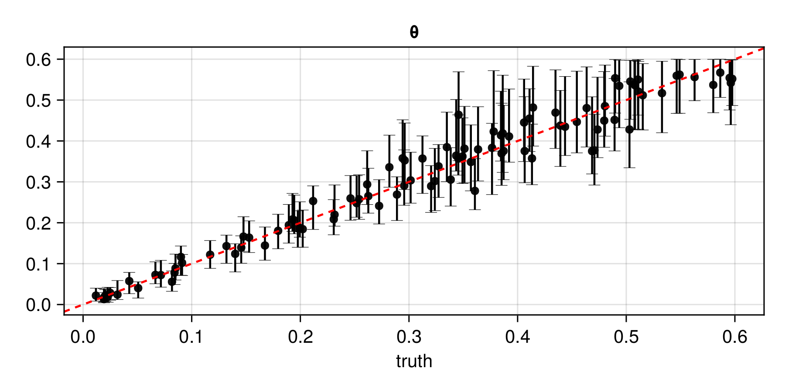

# Gridded data {#Gridded-data}

Here, we develop a neural estimator for a spatial Gaussian process model with exponential covariance function and unknown range parameter $\theta > 0$. The spatial domain is the unit square, data are simulated on a regular $16 \times 16$ grid ($n = 256$ locations), and we adopt the prior $\theta \sim U(0, 0.5)$.

## Package dependencies {#Package-dependencies}

```julia
using NeuralEstimators
using Flux
using CairoMakie
using Distances
using Folds             # parallel simulation (start Julia with --threads=auto)
using LinearAlgebra     # Cholesky factorisation
```


To improve computational efficiency, various GPU backends are supported. Once the relevant package is loaded and a compatible GPU is available, it will be used automatically:

::: code-group

```julia [NVIDIA GPUs]
using CUDA
```


```julia [AMD ROCm GPUs]
using AMDGPU
```


```julia [Metal M-Series GPUs]
using Metal
```


```julia [Intel GPUs]
using oneAPI
```


:::

## Sampling parameters {#Sampling-parameters}

Simulation from Gaussian processes requires computing the Cholesky factor of a covariance matrix, which is expensive but reusable across repeated simulations from the same parameters. We therefore define a custom type `Parameters` subtyping [`AbstractParameterSet`](/API/parametersdata#NeuralEstimators.AbstractParameterSet) to store both the parameters and their corresponding Cholesky factors:

```julia
struct Parameters <: AbstractParameterSet
	θ
	L
end
```


We define two constructors: one that accepts an integer and samples from the prior (used during training), and one that accepts a parameter matrix directly (useful for parametric bootstrap at inference time):

```julia
function sampler(K::Integer)
    θ = 0.5 * rand(K)               # K samples from π(θ) = Unif(0, 0.5)
    Parameters(NamedMatrix(θ = θ))  # Wrap as a named matrix and pass to matrix constructor
end

function Parameters(θ::AbstractMatrix)
	# Spatial locations: 16×16 grid over the unit square
	pts = range(0, 1, length = 16)
	S = expandgrid(pts, pts)

	# Pairwise distances, covariance matrices, and Cholesky factors
	D = pairwise(Euclidean(), S, dims = 1)
	K = size(θ, 2)
	L = Folds.map(1:K) do k
		Σ = exp.(-D ./ θ[k])
		cholesky(Symmetric(Σ)).L
	end

	Parameters(θ, L)
end
```


## Simulating data {#Simulating-data}

We store each simulated data set as a four-dimensional array of dimension $16 \times 16 \times 1 \times m$, where the third dimension is the number of channels (singleton for a univariate process) and the fourth stores independent replicates:

```julia
function simulator(parameters::Parameters, m = 1)
	Folds.map(parameters.L) do L
		n = size(L, 1)
		z = L * randn(n, m)
		reshape(z, 16, 16, 1, m)
	end
end
```


## Constructing the neural network {#Constructing-the-neural-network}

For data collected over a regular grid, the inner network is typically a convolutional neural network (CNN; see, e.g., [Dumoulin and Visin, 2016](https://arxiv.org/abs/1603.07285)). Note that deeper architectures employing residual connections (see [`ResidualBlock`](/API/architectures#NeuralEstimators.ResidualBlock)) often lead to improved performance, and certain pooling layers (e.g., [`GlobalMeanPool`](https://fluxml.ai/Flux.jl/stable/reference/models/layers/#Flux.GlobalMeanPool)) allow the network to accommodate grids of varying dimension; for further discussion, see [Sainsbury-Dale et al. (2025, Sec. S3, S4)](https://doi.org/10.48550/arXiv.2501.04330).

```julia
d = 1                # dimension of the parameter vector θ
num_summaries = 3d   # number of summary statistics for θ

# Inner network (CNN)
ψ = Chain(
	Conv((3, 3), 1 => 32, relu),    # 3×3 filter, 1 → 32 channels
	MaxPool((2, 2)),                 # 2×2 max pooling
	Conv((3, 3), 32 => 64, relu),   # 3×3 filter, 32 → 64 channels
	MaxPool((2, 2)),                 # 2×2 max pooling
	Flux.flatten                     # flatten for fully connected layers
)

# Outer network
ϕ = Chain(Dense(256, 64, relu), Dense(64, num_summaries))

# DeepSet object
network = DeepSet(ψ, ϕ)
```


## Constructing the neural estimator {#Constructing-the-neural-estimator}

We now construct a [`NeuralEstimator`](/API/estimators#Estimators) by wrapping the neural network in the subtype corresponding to the intended inferential method:

::: code-group

```julia [Point estimator]
estimator  = PointEstimator(network, d; num_summaries = num_summaries)
```


```julia [Posterior estimator]
estimator = PosteriorEstimator(network, d; num_summaries = num_summaries)
```


```julia [Ratio estimator]
estimator = RatioEstimator(network, d; num_summaries = num_summaries)
```


:::

## Training the estimator {#Training-the-estimator}

We train the estimators using fixed parameter instances to avoid repeated Cholesky factorisations (see [Storing expensive intermediate objects for data simulation](/examples/advancedusage#Storing-expensive-intermediate-objects-for-data-simulation) and [On-the-fly and just-in-time simulation](/examples/advancedusage#On-the-fly-and-just-in-time-simulation) for further discussion):

```julia
K = 5000
θ_train = sampler(K)
θ_val   = sampler(K)
estimator = train(estimator, θ_train, θ_val, simulator)
```


The empirical risk (average loss) over the training and validation sets can be plotted using [`plotrisk`](/API/training#NeuralEstimators.plotrisk).

One may wish to save a trained estimator and load it in a later session: see [Saving and loading neural estimators](/examples/advancedusage#Saving-and-loading-neural-estimators) for details on how this can be done.

## Assessing the estimator {#Assessing-the-estimator}

The function [`assess`](/API/assessment#NeuralEstimators.assess) can be used to assess the trained estimator:

```julia
θ_test = sampler(1000)      # test parameters
Z_test = simulator(θ_test)  # test data
assessment = assess(estimator, θ_test, Z_test)
```


The resulting [`Assessment`](/API/assessment#NeuralEstimators.Assessment) object contains ground-truth parameters, estimates, and other quantities that can be used to compute quantitative and qualitative diagnostics:

```julia
bias(assessment)      # 0.005
rmse(assessment)      # 0.032
plot(assessment)
```





## Applying the estimator to observed data {#Applying-the-estimator-to-observed-data}

Once an estimator is deemed to be well calibrated, it may be applied to observed data (below, we use simulated data as a stand-in for observed data):

```julia
θ = Parameters(Matrix([0.1]'))   # ground truth (not known in practice)
Z = simulator(θ)                 # stand-in for real data
```


::: code-group

```julia [Point estimator]
estimate(estimator, Z)             # point estimate
```


```julia [Posterior estimator]
sampleposterior(estimator, Z)      # posterior sample
```


```julia [Ratio estimator]
sampleposterior(estimator, Z)      # posterior sample
```


:::

Note that missing data (e.g., due to cloud cover) can be accommodated using the [missing-data methods](/examples/advancedusage#Missing-data) implemented in the package.
