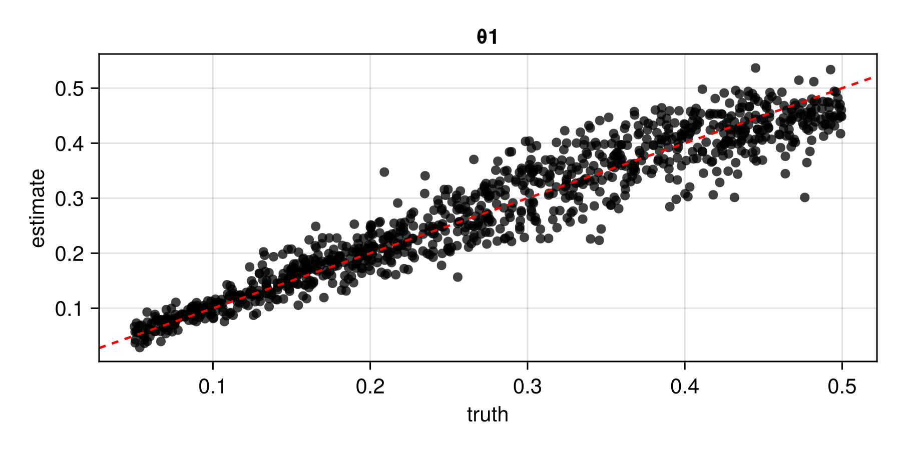

# Irregular spatial data {#Irregular-spatial-data}

Here, we develop a neural estimator for a spatial Gaussian process model with exponential covariance function and unknown range parameter $\theta > 0$, from data collected at arbitrary spatial locations. The estimator is based on a graph neural network (GNN; see [Sainsbury-Dale, Zammit-Mangion, Richards, and Huser, 2025](https://doi.org/10.1080/10618600.2024.2433671)).

## Package dependencies {#Package-dependencies}

```julia
using NeuralEstimators
using Flux
using GraphNeuralNetworks
using Distributions: Uniform
using CairoMakie
using Distances
using Folds                    # parallel simulation (start Julia with --threads=auto)
using LinearAlgebra            # Cholesky factorisation
using Statistics: mean
```


To improve computational efficiency, various GPU backends are supported. Once the relevant package is loaded and a compatible GPU is available, it will be used automatically:

::: code-group

```julia [NVIDIA GPUs]
using CUDA
```


```julia [AMD ROCm GPUs]
using AMDGPU
```


```julia [Metal M-Series GPUs]
using Metal
```


```julia [Intel GPUs]
using oneAPI
```


:::

## Sampling parameters {#Sampling-parameters}

The overall workflow follows previous examples, with two key additional considerations. First, if inference is to be made from a single spatial data set collected at fixed locations, training data can be simulated at those same locations. However, if the estimator is intended for multiple spatial data sets with varying configurations, it should be trained on a diverse set of configurations, which can be sampled using a spatial point process such as [`maternclusterprocess`](/API/miscellaneous#NeuralEstimators.maternclusterprocess). Second, spatial data should be stored as a graph using [`spatialgraph`](/API/miscellaneous#NeuralEstimators.spatialgraph).

As in the gridded example, simulation from Gaussian processes involves expensive intermediate objects (Cholesky factors). Here, we additionally store the spatial graphs needed for graph convolutions. We define a custom type `Parameters` subtyping [`AbstractParameterSet`](/API/parametersdata#NeuralEstimators.AbstractParameterSet):

```julia
struct Parameters <: AbstractParameterSet
	θ   # parameters
	L   # Cholesky factors
	g   # spatial graphs
	S   # spatial locations
end
```


We define two constructors: one that accepts an integer and samples from the prior (used during training), and one that accepts a parameter matrix and spatial locations directly (possibly used for parametric bootstrap):

```julia
function sampler(K::Integer)
	θ = 0.5 * rand(1, K)

	# Sample spatial configurations from a Matérn cluster process on [0, 1]²
	n = rand(200:300, K)
	λ = rand(Uniform(10, 50), K)
	S = [maternclusterprocess(λ = λ[k], μ = n[k]/λ[k]) for k ∈ 1:K]

	Parameters(θ, S)
end

function Parameters(θ::Matrix, S)
	# Covariance matrices and Cholesky factors
	L = Folds.map(axes(θ, 2)) do k
		D = pairwise(Euclidean(), S[k], dims = 1)
		Σ = Symmetric(exp.(-D ./ θ[k]))
		cholesky(Σ).L
	end

	# Spatial graphs
	g = spatialgraph.(S)

	Parameters(θ, L, g, S)
end
```


## Simulating data {#Simulating-data}

```julia
function simulator(parameters::Parameters, m)
	K = size(parameters, 2)
	m = rand(m, K)
	map(1:K) do k
		L = parameters.L[k]
		g = parameters.g[k]
		n = size(L, 1)
		Z = L * randn(n, m[k])
		spatialgraph(g, Z)
	end
end
simulator(parameters::Parameters, m::Integer = 1) = simulator(parameters, range(m, m))
```


## Constructing the neural network {#Constructing-the-neural-network}

We use a GNN architecture tailored to isotropic spatial dependence models; for further details, see [Sainsbury-Dale et al. (2025, Sec. 2.2)](https://doi.org/10.1080/10618600.2024.2433671). We also employ a sparse approximation of the empirical variogram as an expert summary statistic ([Gerber and Nychka, 2021](https://onlinelibrary.wiley.com/doi/abs/10.1002/sta4.382)).

```julia
d = 1                # dimension of the parameter vector θ
num_summaries = 3d   # number of summary statistics for θ

# Spatial weight functions: continuous surrogates for 0-1 basis functions
h_max = 0.15   # maximum distance to consider
q = 10         # output dimension of the spatial weights
w = KernelWeights(h_max, q)

# Propagation module
propagation = Chain(
	SpatialGraphConv(1 => q, relu, w = w, w_out = q),
	SpatialGraphConv(q => q, relu, w = w, w_out = q)
)

# Readout module
readout = GlobalPool(mean)

# Inner network
ψ = GNNSummary(propagation, readout)

# Expert summary statistic: empirical variogram
S = NeighbourhoodVariogram(h_max, q)

# Outer network
ϕ = Chain(
	Dense(2q, 128, relu),
	Dense(128, 128, relu),
	Dense(128, num_summaries)
)

# DeepSet object
network = DeepSet(ψ, ϕ; S = S)
```


## Constructing the neural estimator {#Constructing-the-neural-estimator}

We now construct a [`NeuralEstimator`](/API/estimators#Estimators) by wrapping the neural network in the subtype corresponding to the intended inferential method:

::: code-group

```julia [Point estimator]
estimator = PointEstimator(network, d; num_summaries = num_summaries)
```


```julia [Posterior estimator]
estimator = PosteriorEstimator(network, d; num_summaries = num_summaries)
```


```julia [Ratio estimator]
estimator = RatioEstimator(network, d; num_summaries = num_summaries)
```


:::

## Training the estimator {#Training-the-estimator}

```julia
K = 1000
θ_train = sampler(K)
θ_val   = sampler(K)
estimator = train(estimator, θ_train, θ_val, simulator, epochs = 10)
```


The empirical risk (average loss) over the training and validation sets can be plotted using [`plotrisk`](/API/training#NeuralEstimators.plotrisk).

One may wish to save a trained estimator and load it in a later session: see [Saving and loading neural estimators](/examples/advancedusage#Saving-and-loading-neural-estimators) for details on how this can be done.

## Assessing the estimator {#Assessing-the-estimator}

The function [`assess`](/API/assessment#NeuralEstimators.assess) can be used to assess the trained estimator:

```julia
θ_test = sampler(1000)     # test parameters
Z_test = simulator(θ_test) # test data
assessment = assess(estimator, θ_test, Z_test)
```


The resulting [`Assessment`](/API/assessment#NeuralEstimators.Assessment) object contains ground-truth parameters, estimates, and other quantities that can be used to compute quantitative and qualitative diagnostics:

```julia
bias(assessment)
rmse(assessment)
risk(assessment)
plot(assessment)
```





## Applying the estimator to observed data {#Applying-the-estimator-to-observed-data}

Once an estimator is deemed to be well calibrated, it may be applied to observed data (below, we use simulated data as a stand-in for observed data). Since the estimator was trained on spatial configurations in the unit square, the spatial coordinates of observed data should be scaled to lie within this domain; estimates of any range parameters are then scaled back accordingly.

```julia
parameters = sampler(1)        # ground truth (not known in practice)
θ = parameters.θ               # true parameters
S = parameters.S               # "observed" locations
Z = simulator(parameters)      # stand-in for real data
```


::: code-group

```julia [Point estimator]
estimate(estimator, Z)         # point estimate
```


```julia [Posterior estimator]
sampleposterior(estimator, Z)  # posterior sample
```


```julia [Ratio estimator]
sampleposterior(estimator, Z)  # posterior sample
```


:::
