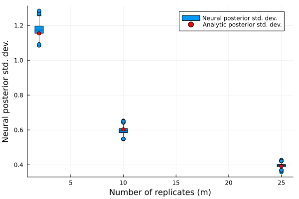

# Advanced usage

## Backends

[Flux.jl](https://fluxml.ai/Flux.jl/stable/) and [Lux.jl](https://lux.csail.mit.edu/stable/) are the primarily supported backends. These frameworks differ in a key way: Flux stores trainable parameters and states inside the network object, while Lux represents them explicitly as separate objects. Flux's stateful, object-oriented style will feel familiar to PyTorch users, while Lux's explicit, functional style will feel familiar to JAX/Flax users.

[SimpleChains.jl](https://github.com/PumasAI/SimpleChains.jl), which is optimised for small networks on the CPU, is also supported via [Lux.jl](https://lux.csail.mit.edu/stable/api/Lux/interop#Lux-Models-to-Simple-Chains).

Despite these differences, the high-level API of NeuralEstimators.jl is largely consistent across backends. The typical workflows are as follows:

::: code-group

```julia [Flux.jl]
using NeuralEstimators, Flux

network   = Flux.Chain(...)
estimator = PointEstimator(network)
estimator = train(estimator, sampler, simulator)
assess(estimator, θ_test, Z_test)
estimate(estimator, Z)
```

```julia [Lux.jl (implicit)]
using NeuralEstimators, Lux

network   = Lux.Chain(...)
estimator = PointEstimator(network)
estimator = train(estimator, sampler, simulator)          
assess(estimator, θ_test, Z_test)
estimate(estimator, Z)
```

```julia [Lux.jl (idiomatic)]
using NeuralEstimators, Lux, Random, Optimisers

network    = Lux.Chain(...)
estimator  = PointEstimator(network)

# Initialize the parameters/states
rng        = Random.default_rng()
ps, st     = Lux.setup(rng, estimator)

# Training
optimiser  = Adam(5e-4)
trainstate = Lux.Training.TrainState(estimator, ps, st, optimiser)
trainstate = train(trainstate, sampler, simulator)
ps         = trainstate.parameters
st         = trainstate.states

assess(estimator, θ_test, Z_test, ps, st)
estimate(estimator, Z, ps, st)
```

```julia [SimpleChains.jl]
using NeuralEstimators, Lux, SimpleChains

# Define Lux network and convert it to SimpleChains
network  = Lux.Chain(...)
adaptor  = ToSimpleChainsAdaptor(...) # declare input size
network  = adaptor(network)

# Then proceed with Lux workflow... 
```

:::

**Notes for Lux.jl users** 
 
Consider loading the [optional dependencies](https://lux.csail.mit.edu/stable/manual/performance_pitfalls#Optional-Dependencies-for-Performance) for improved performance on CPUs. 
 
If you plan to use the GPU via both CUDA and [XLA/Reactant](https://lux.csail.mit.edu/stable/manual/compiling_lux_models) in the same session, ensure that CUDA.jl/cuDNN.jl are loaded before Reactant.jl:

```julia
using CUDA, cuDNN
using Reactant
Reactant.set_default_backend("gpu")
```

For the most computationally efficient setup, use XLA/Reactant.jl during training by passing `device = reactant_device()` to [`train`](@ref).

## Saving and loading estimators

Neural estimators can be saved and loaded in the same way as regular Flux/Lux models (see the [Flux documentation](https://fluxml.ai/Flux.jl/stable/guide/saving/)). For example, to save and load the model state of a Flux-based neural estimator:
```julia
using Flux
using BSON: @save, @load

# Save
model_state = Flux.state(estimator)
@save "estimator.bson" model_state

# Load (initialise an estimator with the same architecture, then load the state)
@load "estimator.bson" model_state
Flux.loadmodel!(estimator, model_state)
```

For **Lux** users, we save the parameters/states directly:
```julia
using Lux
using BSON: @save, @load

# Save
@save "estimator.bson" parameters=estimator.ps states=estimator.st

# Load (initialise an estimator with the same architecture, then load the parameters/states)
@load "estimator.bson" parameters states
estimator = Lux.setparam(estimator, parameters)
```

It is also straightforward to save the entire estimator including its architecture (see [here](https://fluxml.ai/Flux.jl/stable/guide/saving/#Saving-Models-as-Julia-Structs) for Flux), though saving the model state as above is recommended for long-term storage.

For convenience, [`train`](@ref) supports automatic saving of the model state during training via the `savepath` argument.


## Storing expensive intermediate objects for data simulation

Parameters sampled from the prior distribution may be stored in several ways. Most simply, they can be stored as a $d \times K$ matrix, where $d$ is the number of parameters in the model and $K$ is the number of parameter vectors sampled from the prior distribution; more generally, any batchable object compatible with [`numobs`](https://juliaml.github.io/MLUtils.jl/dev/api/#MLCore.numobs)/[`getobs`](https://juliaml.github.io/MLUtils.jl/dev/api/#MLCore.getobs) is supported. 

Alternatively, parameters can be stored in a user-defined subtype of [`AbstractParameterSet`](@ref), whose only requirement is a field `θ` that stores the parameters. With this approach, one may store computationally expensive intermediate objects, such as Cholesky factors, for later use when conducting "on-the-fly" simulation, which is discussed below.

## On-the-fly and just-in-time simulation

When data simulation is (relatively) computationally inexpensive, the training data set, $\mathcal{Z}_{\text{train}}$, can be simulated continuously during training, a technique coined "simulation-on-the-fly". Regularly refreshing $\mathcal{Z}_{\text{train}}$ leads to lower out-of-sample error and to a reduction in overfitting. This strategy therefore facilitates the use of larger, more representationally-powerful networks that are prone to overfitting when $\mathcal{Z}_{\text{train}}$ is fixed. Further, this technique allows for data to be simulated "just-in-time", in the sense that they can be simulated in small batches, used to train the neural estimator, and then removed from memory. This can substantially reduce pressure on memory resources, particularly when working with large data sets.

One may also regularly refresh the set $\vartheta_{\text{train}}$ of parameter vectors used during training, and doing so leads to similar benefits. However, fixing $\vartheta_{\text{train}}$ allows computationally expensive terms, such as Cholesky factors when working with Gaussian process models, to be reused throughout training, which can substantially reduce the training time for some models. Hybrid approaches are also possible, whereby the parameters (and possibly the data) are held fixed for several epochs (i.e., several passes through the training set when performing stochastic gradient descent) before being refreshed.

The above strategies are facilitated with various methods of [`train()`](@ref).


## Feature scaling 

It is important to ensure that the data passed through the neural network are on a reasonable numerical scale, since values with very large absolute value can lead to numerical instability during training (e.g., exploding gradients). 

A relatively simply way to achieve this is by including a transformation in the first layer of the neural network. For example, if the data have positive support, one could define the neural network with the first layer applying a log transformation:

```julia
network = Chain(z -> log.(1 + z), ...)
```

If the data are not strictly positive, one may consider the following signed transformation:

```julia
network = Chain(z -> sign.(z) .* log.(1 .+ abs.(z)), ...)
```

A simple preprocessing layer or transformation pipeline such as this can make a significant difference in performance and stability. See [feature scaling](https://en.wikipedia.org/wiki/Feature_scaling) for further discussion and possible approaches. 

## Regularisation

The term *regularisation* refers to a variety of techniques aimed to reduce overfitting when training a neural network, primarily by discouraging complex models. 

!!! note "Simulation on-the-fly"
	When the training data and parameters are simulated dynamically (i.e., ["on the fly"](@ref "On-the-fly and just-in-time simulation")), overfitting is generally not a concern, making regularisation unnecessary.

One popular regularisation technique is known as dropout, implemented with `Dropout` ([Flux](https://fluxml.ai/Flux.jl/stable/models/layers/#Flux.Dropout)/[Lux](https://lux.csail.mit.edu/stable/api/Lux/layers#Dropout-Layers)). Dropout involves temporarily dropping ("turning off") a randomly selected set of neurons (along with their connections) at each iteration of the training stage, which results in a computationally-efficient form of model (neural-network) averaging [(Srivastava et al., 2014)](https://jmlr.org/papers/v15/srivastava14a.html).

Another class of regularisation techniques involve modifying the loss function. For instance, L₁ regularisation (sometimes called lasso regression) adds to the loss a penalty based on the absolute value of the neural-network parameters. Similarly, L₂ regularisation (sometimes called ridge regression) adds to the loss a penalty based on the square of the neural-network parameters. Note that these penalty terms are not functions of the data or of the statistical-model parameters that we are trying to infer. These regularisation techniques can be implemented straightforwardly by providing a custom `optimiser` rule to [`train`](@ref) that includes a [`SignDecay`](https://fluxml.ai/Flux.jl/stable/reference/training/optimisers/#Optimisers.SignDecay) object for L₁ regularisation, or a [`WeightDecay`](https://fluxml.ai/Flux.jl/stable/reference/training/optimisers/#Optimisers.WeightDecay) object for L₂ regularisation. See the [Optimisers.jl](https://fluxml.ai/Flux.jl/stable/reference/training/optimisers/#Composing-Optimisers) and [Flux.jl](https://fluxml.ai/Flux.jl/stable/guide/training/training/#Regularisation) documentation for further details. 

For illustration, the following code constructs a neural Bayes estimator using dropout and L₁ regularisation with penalty coefficient $10^{-4}$:

```julia
using NeuralEstimators, Flux

# Functions to simulate data Z|μ,σ ~ N(μ, σ²) with μ ~ N(0, 1) and σ ~ U(0, 1)
d, n = 2, 100  # number of parameters and number of replicates
sampler(K) = NamedMatrix(μ = randn(K), σ = rand(K))
simulator(θ::AbstractVector, n) = θ["μ"] .+ θ["σ"] .* sort(randn(n))
simulator(θ::AbstractMatrix, n) = reduce(hcat, simulator.(eachcol(θ), n))

# Fixed training/validation sets
K = 10000
θ_train = sampler(K)
θ_val   = sampler(K)
Z_train = simulator(θ_train, n)
Z_val   = simulator(θ_val, n)

# Neural network with dropout layers
network = Chain(
	Dense(n, 128, relu), 
	Dropout(0.1), 
	Dense(128, 128, gelu), 
	Dropout(0.1),
	Dense(128, d)
	)

# Initialise estimator
estimator = PointEstimator(network)

# Optimiser with L₁ regularisation
optimiser = OptimiserChain(SignDecay(1e-4), Adam(5e-4))

# Train the estimator
train(estimator, θ_train, θ_val, Z_train, Z_val; optimiser = optimiser)
```

## Expert summary statistics

Implicitly, neural estimators involve the learning of summary statistics. However, some summary statistics are available in closed form, simple to compute, and highly informative (e.g., sample quantiles, the empirical variogram). Often, explicitly incorporating these expert summary statistics in a neural estimator can simplify the optimisation problem, and lead to a better estimator.

The fusion of learned and expert summary statistics is facilitated by the [`DataSet`](@ref) struct, which couples raw data with a matrix of precomputed expert summary statistics. These are concatenated with the learned summary statistics during both training and inference, regardless of the chosen neural-network architecture. Note that a neural estimator based purely on expert summary statistics (see, e.g., [Gerber and Nychka, 2021](https://onlinelibrary.wiley.com/doi/abs/10.1002/sta4.382); [Rai et al. ,2024](https://onlinelibrary.wiley.com/doi/abs/10.1002/env.2845)) can be constructed by setting the summary network to `identity` and passing the summary statistics directly as a matrix. Note also that users may specify arbitrary expert summary statistics, however for convenience several standard [User-defined summary statistics](@ref) are provided with the package, including a fast, sparse approximation of the empirical variogram.

For an example of incorporating expert summary statistics, see [Irregular spatial data](@ref), where the empirical variogram is used alongside learned graph-neural-network-based summary statistics.

## Parameter constraints

Many models have parameter constraints (e.g., variance and range parameters that must be strictly positive). These constraints can be accounted for in various way. For example, when constructing a neural Bayes estimator (i.e., a point estimator), they can be incorporated in the final layer of the neural network by choosing appropriate activation functions for each parameter. Below, we construct a neural Bayes estimator for $\boldsymbol{\theta} = (\mu, \sigma)'$ that enforces the constraint $\sigma > 0$ by applying the softplus activation function in the final layer of the outer network. For additional ways to constrain parameter estimates, see [Output layers](@ref).

```julia
n = 1    # dimension of each data replicate (univariate)
d = 2    # dimension of the parameter vector θ
w = 128  # width of each hidden layer 

# Final layer has output dimension d and enforces parameter constraints
final_layer = Parallel(
    vcat,
    Dense(w, 1, identity),     # μ ∈ ℝ
    Dense(w, 1, softplus)      # σ > 0
)

# Inner and outer networks
ψ = Chain(Dense(n, w, relu), Dense(w, d, relu))    
ϕ = Chain(Dense(d, w, relu), final_layer)          

# Combine into a DeepSet
network = DeepSet(ψ, ϕ)
```

## Variable sample sizes

A neural estimator based on the [DeepSet](@ref) representation can be applied to data sets of arbitrary sample size $m$. However, the posterior distribution, and summaries derived from it, typically depends on $m$, and neural estimators must account for this dependence if data sets with varying $m$ are envisaged. 

!!! note "Aggregation functions and variable sample sizes"
    When the sample size $m$ is fixed, the choice of aggregation function used in the [DeepSet](@ref) representation is typically driven by considerations of numerical stability. For example, mean aggregation is often preferred over sum to avoid exploding gradients when $m$ is large. However, not all functions that perform well for fixed sample sizes preserve the ability of the network to generalise across different sample sizes. Specifically, the mean aggregation function, while numerically stable, discards information about $m$. 

	One has several options when designing a neural network to accomodate variable sample sizes. 
	- Sum aggregation. This is effective with small to moderate values $m$, but can lead to exploding gradients when $m$ becomes large. 
    - Mean aggregation with $m$ explicitly input to the neural network. This can be done by supplying [`logsamplesize`](@ref) or [`invsqrtsamplesize`](@ref) as an [expert summary statistic](@ref "Expert summary statistics") when constructing the [DeepSet](@ref). 

Let a data set consisting of $m$ conditionally independent replicates be denoted by $\boldsymbol{Z}^{(m)} \equiv (\boldsymbol{Z}_1', \dots, \boldsymbol{Z}_m')'$. If data sets with varying $m$ are envisaged, a generally applicable approach is to treat the sample size as a random variable, $M$, with support over a set of positive integers. One then places a distribution on $M$ (e.g., discrete uniform) that is sampled from when simulating data during the training phase. Note that the choice of distribution for $M$ is theoretically immaterial, provided it assigns positive mass on all sample sizes of interest (this follows from similar arguments given by [Richards et al., 2024, Theorem 1](https://www.jmlr.org/papers/v25/23-1134.html) and [Sainsbury-Dale et al., 2025, Theorem 1](https://doi.org/10.1080/10618600.2024.2433671)). 

Treating the sample size as random is an effective approach that only requires minor modifications to the workflow for fixed sample sizes. Specifically, the following pseudocode illustrates how one may modify a general data simulator to train under a range of sample sizes, with the distribution of $M$ defined by passing any object that can be sampled using `rand(M, K)` (e.g., the integer range `1:30`):

```julia 
# Method that allows M to be an object that can be sampled from
function simulate(θ, M)
	# Number of parameter vectors 
	K = size(θ, 2)

	# Generate K sample sizes from the distribution for M
	m = rand(M, K)

	# Pseudocode for data simulation
	Z = [<simulate m[k] realisations from the model given θ[:, k]> for k ∈ 1:K]

	return Z
end

# Wrapper that allows a single fixed integer sample size
simulate(parameters, m::Integer) = simulate(parameters, range(m, m))
```

The following simple example illustrates this approach using a conjugate Gaussian model. Specifically, we assume a Gaussian likelihood with unknown mean $\mu$, known variance $\sigma^2$, and a Gaussian prior with mean $\mu_0$ and variance $\sigma_0^2$. 

```julia
using NeuralEstimators, Flux
using DataFrames
using Distributions
using Plots
using StatsPlots

n = 1  # dimension of each data replicate 
d = 1  # dimension of the parameter vector θ
σ = 2  # known standard deviation of the data 
μ₀ = 1 # prior mean 
σ₀ = 2 # prior standard deviation 

function sample(K)
    θ = rand(Normal(μ₀, σ₀), 1, K)
    return θ
end

function simulate(θ, M)
    Z = [ϑ .+  σ * randn(n, rand(M)) for ϑ ∈ eachcol(θ)]
    return Z
end
simulate(θ, m::Integer) = simulate(θ, range(m, m))

# Approximate distribution based on dstar summary statistics 
dstar = 2d 
q = GaussianMixture(d, dstar)

# Neural network mapping data to summary statistics of the same dimension used in q, 
# using default mean aggreation with log(m) as an "expert summary statistic"
w = 128 
S(Z) = log.(samplesize(Z))
ψ = Chain(
	Dense(n, w, relu), 
	Dense(w, w, relu), 
	Dense(w, w, relu)
	)
ϕ = Chain(
	Dense(w + 1, w, relu), # input dimension w + 1 to accommodate "expert summary statistic"
	Dense(w, w, relu), 
	Dense(w, dstar)
	)
network = DeepSet(ψ, ϕ; S = S)

# Initialise the neural posterior estimator
estimator = PosteriorEstimator(q, network)

# Train the estimator with the sample size randomly sampled between 2 and 25
estimator = train(estimator, sample, simulate; K = 30_000, simulator_args = 2:25) 
```

Since the posterior is available in closed form for this example, we can directly compare the standard deviation of the neural posterior to the analytic posterior standard deviation as a function of the sample size $m$. Importantly, the analytic posterior standard deviation is deterministic; it depends only on $\sigma_0$, $\sigma$, and $m$, and not on the observed data. However, we do not expect a neural network to capture this behavior exactly, especially when trained on finite data. As such, some sampling variability in the estimated posterior standard deviation is expected, even when the true value is constant for a given $m$:


```julia
# Closed-form expression for the posterior standard deviation
analyticstd(σ₀, σ, m) = sqrt(1 / (1 / σ₀^2 + m / σ^2))

# Simulate data and return posterior standard deviation from estimator
function simulate_neural_std(estimator, m)
    μ = sample(1)
    Z = simulate(μ, m)  
    post_samples = sampleposterior(estimator, Z)
    return std(post_samples, corrected = false)
end

# Sample sizes to evaluate
m_range = [2, 10, 25]

# Estimate posterior std dev for many data sets
neural_std = map(m_range) do m 
    mapreduce(_ -> simulate_neural_std(estimator, m), vcat, 1:1000) 
end
df = DataFrame(
	neural_std = reduce(vcat, neural_std),
	m = repeat(m_range, inner = 1000)
)

# Boxplot: neural posterior std dev by sample size
@df df boxplot(:m, :neural_std;
    xlabel = "Number of replicates (m)",
    ylabel = "Neural posterior std. dev.",
    label = "Neural posterior std. dev."
)

# Overlay analytic posterior std. dev.
true_std = [analyticstd(σ₀, σ, m) for m in m_range]
scatter!(m_range, true_std;
    color = :red,
    markershape = :circle,
    label = "Analytic posterior std. dev.",
    legend = :topright
)
```
