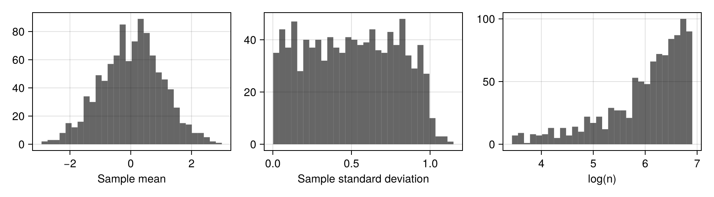
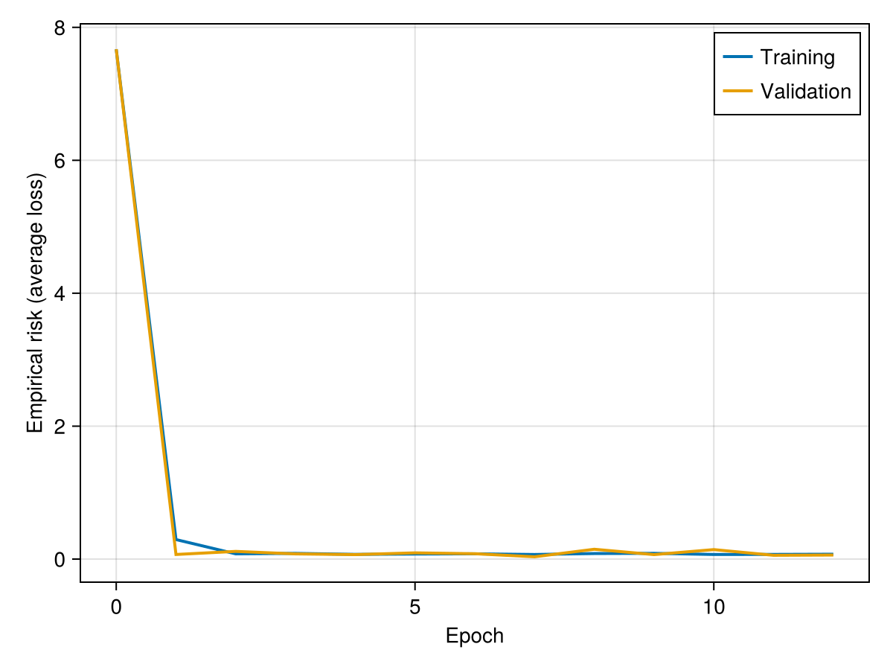
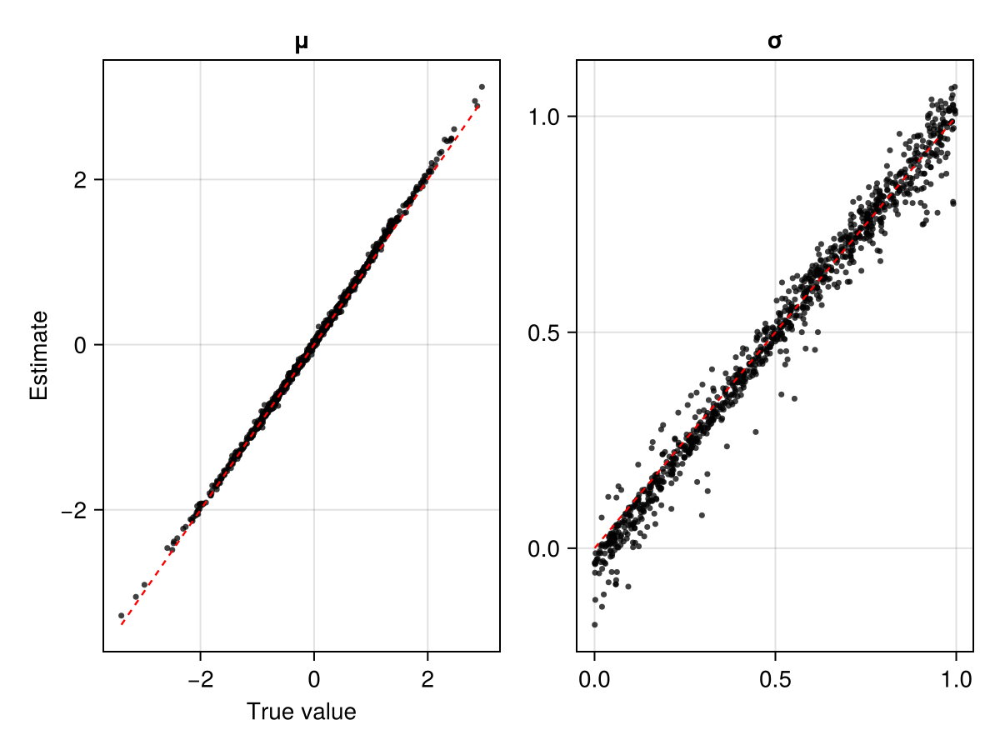
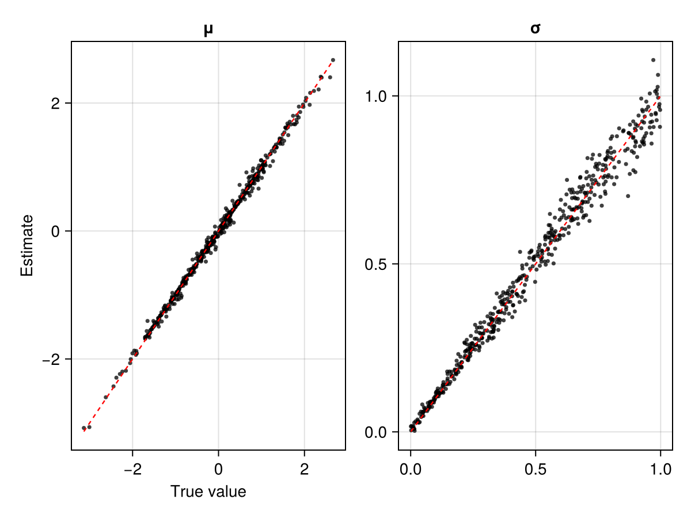

# Expert summary statistics

Implicitly, neural estimators involve the learning of summary statistics. However, some summary statistics are available in closed form, simple to compute, and highly informative (e.g., sample quantiles, the empirical variogram). Often, explicitly incorporating these expert summary statistics in a neural estimator can simplify training and lead to a better estimator.

In the following examples, we develop a neural estimator to infer $\boldsymbol{\theta} \equiv (\mu, \sigma)'$ from data $\boldsymbol{Z} \equiv (Z_1, \dots, Z_n)'$, where $Z_i \overset{\mathrm{iid}}{\sim} N(\mu,\, \sigma^2)$. The sufficient statistics for $(\mu, \sigma)'$ are the sample mean $\bar{Z}$ and sample standard deviation $s$, and the sample size $n$ is also needed for posterior variances, giving three expert summary statistics.


### Package dependencies

```julia
using NeuralEstimators
using Statistics: mean, std
using CairoMakie
```

To improve computational efficiency, various GPU backends are supported. Once the relevant package is loaded and a compatible GPU is available, it will be used automatically:

::: code-group

```julia [NVIDIA GPUs]
using CUDA, cuDNN
```

```julia [AMD ROCm GPUs]
using AMDGPU
```

```julia [Metal M-Series GPUs]
using Metal
```

```julia [Intel GPUs]
using oneAPI
```

:::

Select a deep-learning backend:

::: code-group

```julia [Lux]
using Lux, Zygote
```

```julia [Flux]
using Flux
```

:::

## Expert summaries only

A neural estimator based only on user-defined expert summary statistics (see, e.g., [Gerber and Nychka, 2021](https://onlinelibrary.wiley.com/doi/abs/10.1002/sta4.382); [Rai et al., 2024](https://onlinelibrary.wiley.com/doi/abs/10.1002/env.2845); [Lambe et al, 2026](https://arxiv.org/abs/2506.01258)) can be constructed by omitting the summary network and providing the expert summaries as a matrix.

### Sampling parameters and simulating data

We first define functions to sample parameters from the prior distribution and to simulate data. Since there are no replicates here, the simulator returns a vector of summary statistics directly for each parameter vector:

```julia
d = 2              # dimension of θ
num_summaries = 3  # number of expert summaries

# Function to sample from the prior
sampler(K) = NamedMatrix(μ = randn(K), σ = rand(K))

# Function to simulate data
function simulator(θ::AbstractVector, n::Integer)
    Z = θ["μ"] .+ θ["σ"] .* randn(n)
    S = [mean(Z), std(Z), log(n)]
    return S
end
simulator(θ::AbstractVector, n) = simulator(θ, rand(n))
simulator(θ::AbstractMatrix, n) = reduce(hcat, simulator.(eachcol(θ), Ref(n)))
```

Since the simulator returns summary statistics rather than raw data, it is the distribution of those statistics that the estimator sees. Plotting them over draws from the prior, and over the range of sample sizes used during training, shows what information is available to it:

```julia
θ = sampler(1000)
S = simulator(θ, 30:1000)

labels = ["Sample mean", "Sample standard deviation", "log(n)"]
fig = Figure(size = (900, 250))
for j in 1:3
    ax = Axis(fig[1, j], xlabel = labels[j])
    hist!(ax, S[j, :], bins = 30, color = (:black, 0.6))
end
fig
```



### Constructing the neural estimator

Since the summary statistics are precomputed, no summary network is needed: omit it and pass `num_summaries` in the usual way.

::: code-group

```julia [Point estimator]
estimator = PointEstimator(d; num_summaries = num_summaries)
```

```julia [Posterior estimator]
estimator = PosteriorEstimator(d; num_summaries = num_summaries, q = GaussianMixture)
```

```julia [Ratio estimator]
estimator = RatioEstimator(d; num_summaries = num_summaries)
```

:::

### Training the estimator

Next, we train the estimator using [`train`](@ref). We train over a range of sample sizes so that the estimator learns to handle varying $n$:

```julia
# Sample sizes used during training
n_training = 30:1000

estimator = train(estimator, sampler, simulator; simulator_args = (n_training,))
```

Training progress is reported in the terminal:


The empirical risk (average loss) over the training and validation sets can be plotted using [`plotrisk`](@ref):

```julia
plotrisk()
```



### Assessing the estimator

The function [`assess`](@ref) can then be used to assess the trained estimator based on unseen test data:

```julia
n_test = 500
θ_test = sampler(1000)
Z_test = simulator(θ_test, n_test)

assessment = assess(estimator, θ_test, Z_test)
bias(assessment)
rmse(assessment)
plot(assessment)
```



### Applying the estimator to observed data

Once an estimator is deemed to be well calibrated, it may be applied to observed data (below, we use simulated data as a stand-in for observed data):

```julia
θ = sampler(1)                   # ground truth (not known in practice)
Z = simulator(θ, n_test)         # stand-in for real observations
```

::: code-group

```julia [Point estimator]
estimate(estimator, Z)             # point estimate
```

```julia [Posterior estimator]
sampleposterior(estimator, Z)      # posterior sample
```

```julia [Ratio estimator]
sampleposterior(estimator, Z)      # posterior sample
```

:::

## Expert and learned summaries

The fusion of expert and learned summary statistics is facilitated by [`DataAndSummaries`](@ref), which couples raw data with precomputed expert summary statistics. This allows the estimator to benefit from both the interpretability and efficiency of expert summaries and the flexibility of learned representations.


### Sampling parameters and simulating data

The simulator returns a [`DataAndSummaries`](@ref) object that pairs the raw data with a matrix of precomputed expert summaries. The expert summaries (here, the sample mean and standard deviation) are computed over the replicate dimension and will be concatenated with the learned summaries before being passed to the inference network:

```julia
d = 2    # dimension of θ
n = 100  # number of replicates (fixed in this example)

# Function to sample from the prior
sampler(K) = NamedMatrix(μ = randn(K), σ = rand(K))

# Functions to simulate data
function simulator(θ::AbstractVector)
    Z = θ["μ"] .+ θ["σ"] .* sort(randn(n))
    return Z
end
function simulator(θ::AbstractMatrix)
    Z = reduce(hcat, map(simulator, eachcol(θ)))
    S = vcat(mean(Z, dims = 1), std(Z, dims = 1))
    return DataAndSummaries(Z, S)
end
```

### Constructing the neural estimator

We construct a summary network that maps the raw data to a set of learned summary statistics, and specify `num_summaries` as the total number of expert and learned summaries combined:

```julia
num_expert_summaries  = 2
num_learned_summaries = 3d
summary_network = Chain(Dense(n, 64, gelu), Dense(64, 64, gelu), Dense(64, num_learned_summaries))
```

::: code-group

```julia [Point estimator]
estimator = PointEstimator(summary_network, d; num_summaries = num_expert_summaries + num_learned_summaries)
```

```julia [Posterior estimator]
estimator = PosteriorEstimator(summary_network, d; q = GaussianMixture, num_summaries = num_expert_summaries + num_learned_summaries)
```

```julia [Ratio estimator]
estimator = RatioEstimator(summary_network, d; num_summaries = num_expert_summaries + num_learned_summaries)
```

:::

### Training the estimator

Next, we train the estimator using [`train`](@ref):

```julia
estimator = train(estimator, sampler, simulator)
```

Training progress is reported in the terminal:


### Assessing the estimator

The function [`assess`](@ref) can then be used to assess the trained estimator based on unseen test data:

```julia
θ_test = sampler(500)
Z_test = simulator(θ_test)

assessment = assess(estimator, θ_test, Z_test)
bias(assessment)
rmse(assessment)
plot(assessment)
```



### Applying the estimator to observed data

Once an estimator is deemed to be well calibrated, it may be applied to observed data (below, we use simulated data as a stand-in for observed data):

```julia
θ = sampler(1)                 # ground truth (not known in practice)
Z = simulator(θ)               # stand-in for real observations
```

::: code-group

```julia [Point estimator]
estimate(estimator, Z)             # point estimate
```

```julia [Posterior estimator]
sampleposterior(estimator, Z)      # posterior sample
```

```julia [Ratio estimator]
sampleposterior(estimator, Z)      # posterior sample
```

:::
