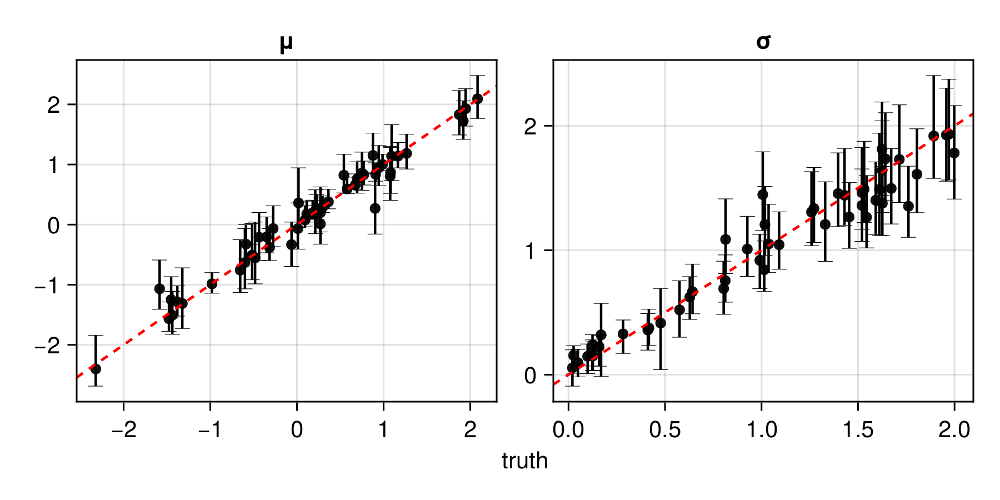

# Replicated unstructured data

Here, we develop a neural estimator to infer $\boldsymbol{\theta} \equiv (\mu, \sigma)'$ from data $\boldsymbol{Z} \equiv (Z_1, \dots, Z_m)'$, where $Z_i \overset{\mathrm{iid}}{\sim} N(\mu,\, \sigma^2)$. We adopt the marginal priors $\mu \sim N(0, 1)$ and $\sigma \sim \text{IG}(3, 1)$.

## Package dependencies

```julia
using NeuralEstimators
using Flux             
using Distributions: InverseGamma
using CairoMakie
```

Flux and Lux are both supported:

::: code-group

```julia [Flux]
using Flux
```

```julia [Lux]
using Lux
```

:::

To improve computational efficiency, various GPU backends are supported. Once the relevant package is loaded and a compatible GPU is available, it will be used automatically:

::: code-group

```julia [NVIDIA GPUs]
using CUDA
```

```julia [AMD ROCm GPUs]
using AMDGPU
```

```julia [Metal M-Series GPUs]
using Metal
```

```julia [Intel GPUs]
using oneAPI
```

:::

## Sampling parameters

We first define a function to sample parameters from the prior distribution. Here, we store the parameters as a [`NamedMatrix`](@ref) so that parameter estimates are automatically labelled, though this is not required:

```julia
function sampler(K)
	NamedMatrix(
		μ = randn(K), 
		σ = rand(InverseGamma(3, 1), K)
	)
end
```

## Simulating data

Next, we define the statistical model implicitly through simulation. Our data consist of $m$ independent replicates, and we wish to accommodate varying $m$ across data sets. We therefore use a DeepSets architecture, where the simulated data for each parameter vector are stored as a separate element of a `Vector`. In this example each replicate $Z_i$ is univariate, so each element is a `Matrix` with one row and $m$ columns.

We define three methods for simulating data, illustrating Julia's multiple dispatch and short-form function syntax: the first simulates a data set of fixed size $m$ for a single parameter vector; the second simulates a data set of random size drawn from a range; and the third applies these over a matrix of parameter vectors:
```julia
simulator(θ::AbstractVector, m::Integer) = θ["μ"] .+ θ["σ"] .* randn(1, m)
simulator(θ::AbstractVector, m) = simulator(θ, rand(m))
simulator(θ::AbstractMatrix, m = 10:100) = [simulator(ϑ, m) for ϑ in eachcol(θ)]
```

## Constructing the neural network

In this package, the neural network specified by the user is typically a summary network that transforms data into a vector of $d^*$ summary statistics for $\boldsymbol{\theta}$, where $d^*$ is user-specified. A common heuristic is to set $d^*$ to a multiple of $d$, the number of unknown parameters (e.g., $d^* = 3d$).

In this example, our data are replicated, and we therefore adopt the DeepSets framework, implemented via [`DeepSet`](@ref). A `DeepSet` consists of three components: an inner network that acts directly on each data replicate; a function that aggregates the outputs of the inner network; and an outer network (typically an MLP) that maps the aggregated output to $\mathbb{R}^{d^*}$. The architecture of the inner network depends on the structure of the data; for unstructured data (i.e., without spatial or temporal correlation within each replicate), an MLP is used, with input dimension matching the dimensionality of each replicate (here, one).

```julia
n = 1                # dimension of each data replicate (univariate)
d = 2                # dimension of the parameter vector θ
num_summaries = 3d   # number of summary statistics for θ
w = 64               # width of each hidden layer

ψ = Chain(Dense(n, w, relu), Dense(w, w, relu))         # inner network
ϕ = Chain(Dense(w, w, relu), Dense(w, num_summaries))   # outer network
network = DeepSet(ψ, ϕ)
```

## Constructing the neural estimator

We now construct a [`NeuralEstimator`](@ref "Estimators") by wrapping the neural network in the subtype corresponding to the intended inferential method:

::: code-group

```julia [Point estimator]
estimator = PointEstimator(network, d; num_summaries = num_summaries)
```

```julia [Posterior estimator]
estimator = PosteriorEstimator(network, d; num_summaries = num_summaries)
```

```julia [Ratio estimator]
estimator = RatioEstimator(network, d; num_summaries = num_summaries)
```

:::

If using Lux.jl, we also wrap the estimator as a [`LuxEstimator`](@ref) to store the trainable parameters and states:

::: code-group

```julia [Lux]
estimator = LuxEstimator(estimator)
```

```julia [Flux]
# Nothing to do!
```

:::

## Training the estimator

Next, we train the estimator using [`train`](@ref). Below, we pass our user-defined functions for sampling parameters and simulating data, but one may also pass fixed parameter and/or data instances:

::: code-group

```julia [Flux]
estimator = train(estimator, sampler, simulator)
```

```julia [Lux]
# Initialise the network parameters and states
ps, st = Lux.setup(rng, estimator)

# Training
estimator, ps, st = train(estimator, sampler, simulator; ps=ps, st=st)
```

:::

The empirical risk (average loss) over the training and validation sets can be plotted using [`plotrisk`](@ref). 

One may wish to save a trained estimator and load it in a later session: see [Saving and loading neural estimators](@ref) for details on how this can be done.


## Assessing the estimator

The function [`assess`](@ref) can then be used to assess the trained estimator based on unseen test data simulated from the statistical model:

```julia
θ_test = sampler(1000)           # test parameters
Z_test = simulator(θ_test, 50)   # test data

assessment = assess(estimator, θ_test, Z_test)
```

The resulting [`Assessment`](@ref) object contains ground-truth parameters, estimates, and other quantities that can be used to compute quantitative and qualitative diagnostics:

```julia
bias(assessment)      # μ = 0.002, σ = 0.017
rmse(assessment)      # μ = 0.086, σ = 0.078
risk(assessment)      # 0.055
plot(assessment)
```



## Applying the estimator to observed data

Once an estimator is deemed to be well calibrated, it may be applied to observed data (below, we use simulated data as a stand-in for observed data):

```julia
θ = sampler(1)                      # ground truth (not known in practice)
Z = simulator(θ, 100)               # stand-in for real data
```

::: code-group

```julia [Point estimator]
estimate(estimator, Z)             # point estimate
interval(bootstrap(estimator, Z))  # 95% non-parametric bootstrap intervals
```

```julia [Posterior estimator]
sampleposterior(estimator, Z)      # posterior sample
```

```julia [Ratio estimator]
sampleposterior(estimator, Z)      # posterior sample
```

:::
