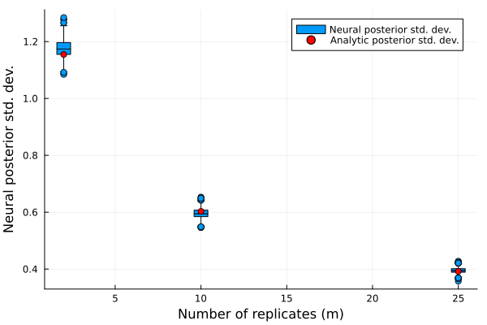
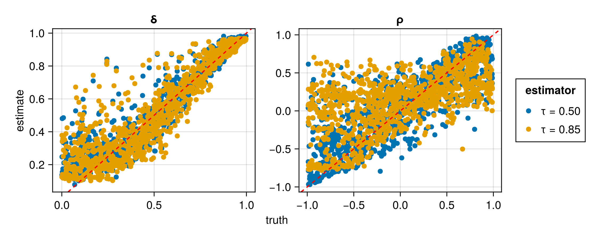

# Advanced usage

## Saving and loading neural estimators

In regards to saving and loading, neural estimators behave in the same manner as regular Flux models. Therefore, the examples and recommendations outlined in the [Flux documentation](https://fluxml.ai/Flux.jl/stable/guide/saving/) also apply directly to neural estimators. For example, to save the model state of the neural estimator `estimator`, run:

```julia
using Flux
using BSON: @save, @load
model_state = Flux.state(estimator)
@save "estimator.bson" model_state
```

Then, to load it in a new session, one may initialise a neural estimator with the same architecture used previously, and load the saved model state as follows:

```julia
@load "estimator.bson" model_state
Flux.loadmodel!(estimator, model_state)
```

It is also straightforward to save the entire neural estimator, including its architecture (see [here](https://fluxml.ai/Flux.jl/stable/guide/saving/#Saving-Models-as-Julia-Structs)). However, the first approach outlined above is recommended for long-term storage.

For convenience, the function [`train()`](@ref) allows for the automatic saving of the model state during the training stage, via the argument `savepath`.

## Storing expensive intermediate objects for data simulation

Parameters sampled from the prior distribution may be stored in two ways. Most simply, they can be stored as a $d \times K$ matrix, where $d$ is the number of parameters in the model and $K$ is the number of parameter vectors sampled from the prior distribution. Alternatively, they can be stored in a user-defined subtype of [`ParameterConfigurations`](@ref), whose only requirement is a field `θ` that stores the $d \times K$ matrix of parameters. With this approach, one may store computationally expensive intermediate objects, such as Cholesky factors, for later use when conducting "on-the-fly" simulation, which is discussed below.

## On-the-fly and just-in-time simulation

When data simulation is (relatively) computationally inexpensive, the training data set, $\mathcal{Z}_{\text{train}}$, can be simulated continuously during training, a technique coined "simulation-on-the-fly". Regularly refreshing $\mathcal{Z}_{\text{train}}$ leads to lower out-of-sample error and to a reduction in overfitting. This strategy therefore facilitates the use of larger, more representationally-powerful networks that are prone to overfitting when $\mathcal{Z}_{\text{train}}$ is fixed. Further, this technique allows for data to be simulated "just-in-time", in the sense that they can be simulated in small batches, used to train the neural estimator, and then removed from memory. This can substantially reduce pressure on memory resources, particularly when working with large data sets.

One may also regularly refresh the set $\vartheta_{\text{train}}$ of parameter vectors used during training, and doing so leads to similar benefits. However, fixing $\vartheta_{\text{train}}$ allows computationally expensive terms, such as Cholesky factors when working with Gaussian process models, to be reused throughout training, which can substantially reduce the training time for some models. Hybrid approaches are also possible, whereby the parameters (and possibly the data) are held fixed for several epochs (i.e., several passes through the training set when performing stochastic gradient descent) before being refreshed.

The above strategies are facilitated with various methods of [`train()`](@ref).


## Feature scaling 

It is important to ensure that the data passed through the neural network are on a reasonable numerical scale, since values with very large absolute value can lead to numerical instability during training (e.g., exploding gradients). 

A relatively simply way to achieve this is by including a transformation in the first layer of the neural network. For example, if the data have positive support, one could define the neural network with the first layer applying a log transformation:

```julia
network = Chain(z -> log.(1 + z), ...)
```

If the data are not strictly positive, one may consider the following signed transformation:

```julia
network = Chain(z -> sign.(z) .* log.(1 .+ abs.(z)), ...)
```

A simple preprocessing layer or transformation pipeline such as this can make a significant difference in performance and stability. See [feature scaling](https://en.wikipedia.org/wiki/Feature_scaling) for further discussion and possible approaches. 

## Regularisation

The term *regularisation* refers to a variety of techniques aimed to reduce overfitting when training a neural network, primarily by discouraging complex models.

A popular regularisation technique is known as dropout, implemented in Flux's [`Dropout`](https://fluxml.ai/Flux.jl/stable/models/layers/#Flux.Dropout) layer. Dropout involves temporarily dropping ("turning off") a randomly selected set of neurons (along with their connections) at each iteration of the training stage, which results in a computationally-efficient form of model (neural-network) averaging [(Srivastava et al., 2014)](https://jmlr.org/papers/v15/srivastava14a.html).

Another class of regularisation techniques involve modifying the loss function. For instance, L₁ regularisation (sometimes called lasso regression) adds to the loss a penalty based on the absolute value of the neural-network parameters. Similarly, L₂ regularisation (sometimes called ridge regression) adds to the loss a penalty based on the square of the neural-network parameters. Note that these penalty terms are not functions of the data or of the statistical-model parameters that we are trying to infer. These regularisation techniques can be implemented straightforwardly by providing a custom `optimiser` to [`train()`](@ref) that includes a [`SignDecay`](https://fluxml.ai/Flux.jl/stable/reference/training/optimisers/#Optimisers.SignDecay) object for L₁ regularisation, or a [`WeightDecay`](https://fluxml.ai/Flux.jl/stable/reference/training/optimisers/#Optimisers.WeightDecay) object for L₂ regularisation. See the [Flux documentation](https://fluxml.ai/Flux.jl/stable/guide/training/training/#Regularisation) for further details. Note that, when the training data and parameters are simulated dynamically (i.e., "on the fly"; see [On-the-fly and just-in-time simulation](@ref)), overfitting is generally not a concern, making this form of regularisation unnecessary.

For illustration, the following code constructs a neural Bayes estimator using dropout and L₁ regularisation with penalty coefficient $\lambda = 10^{-4}$:

```julia
using NeuralEstimators, Flux

# Data Z|θ ~ N(θ, 1) with θ ~ N(0, 1)
d = 1     # dimension of the parameter vector θ
n = 1     # dimension of each independent replicate of Z
m = 5     # number of independent replicates in each data set
sampler(K) = randn32(d, K)
simulator(θ, m) = [μ .+ randn32(n, m) for μ ∈ eachcol(θ)]
K = 3000  # number of training samples
θ_train = sampler(K)
θ_val   = sampler(K)
Z_train = simulator(θ_train, m)
Z_val   = simulator(θ_val, m)

# Neural network with dropout layers
w = 128
ψ = Chain(Dense(1, w, relu), Dropout(0.1), Dense(w, w, relu), Dropout(0.5))     
ϕ = Chain(Dense(w, w, relu), Dropout(0.5), Dense(w, 1))           
network = DeepSet(ψ, ϕ)

# Initialise estimator
estimator = PointEstimator(network)

# Optimiser with L₁ regularisation
optimiser = Flux.setup(OptimiserChain(SignDecay(1e-4), Adam()), estimator)

# Train the estimator
train(estimator, θ_train, θ_val, Z_train, Z_val; optimiser = optimiser)
```

## Expert summary statistics

Implicitly, neural estimators involve the learning of summary statistics. However, some summary statistics are available in closed form, simple to compute, and highly informative (e.g., sample quantiles, the empirical variogram). Often, explicitly incorporating these expert summary statistics in a neural estimator can simplify the optimisation problem, and lead to a better estimator.

The fusion of learned and expert summary statistics is facilitated by our implementation of the [`DeepSet`](@ref) framework. Note that this implementation also allows the user to construct a neural estimator using only expert summary statistics, following, for example, [Gerber and Nychka (2021)](https://onlinelibrary.wiley.com/doi/abs/10.1002/sta4.382) and [Rai et al. (2024)](https://onlinelibrary.wiley.com/doi/abs/10.1002/env.2845). Note also that the user may specify arbitrary expert summary statistics, however, for convenience several standard [User-defined summary statistics](@ref) are provided with the package, including a fast, sparse approximation of the empirical variogram.

For an example of incorporating expert summary statistics, see [Irregular spatial data](@ref), where the empirical variogram is used alongside learned graph-neural-network-based summary statistics.

## Variable sample sizes

A neural estimator based on the [DeepSet](@ref) representation can be applied to data sets of arbitrary sample size $m$. However, the posterior distribution, and summaries derived from it, typically depends on $m$, and neural estimators must account for this dependence if data sets with varying $m$ are envisaged. 

!!! note "Aggregation functions and variable sample sizes"
    When the sample size is $m$ fixed, the choice of aggregation function used in the [DeepSet](@ref) representation is typically driven by considerations of numerical stability. For example, mean aggregation is often preferred over sum to avoid exploding gradients when $m$ is large. However, not all functions that perform well for fixed sample sizes preserve the ability of the network to generalise across different sample sizes. Specifically, the mean aggregation function, while numerically stable, discards information about $m$. 

	One has several options when designing a neural network to accomodate variable sample sizes. 
	- Use sum aggregation. This is effective with small to moderate values $m$, but can lead to exploding gradients when $m$ becomes large. 
    - Use mean aggregation with $m$ explicitly input to the neural network. This can be done by supplying [`logsamplesize`](@ref) or [`invsqrtsamplesize`](@ref) as an [expert summary statistic](@ref "Expert summary statistics") when constructing the [DeepSet](@ref). 
    - Use a hybrid aggregation that maintains numerical stability while implicitly encoding $m$. For example, `weightedsum(X; dims) = logsamplesize(X) .* mean(X; dims)`. Since $m$ is not explicitly provided to the network in this approach, it may be beneficial to combine it with the previous strategy. 

Let a data set consisting of $m$ conditionally independent replicates be denoted by $\boldsymbol{Z}^{(m)} \equiv (\boldsymbol{Z}_1', \dots, \boldsymbol{Z}_m')'$. If data sets with varying $m$ are envisaged, a generally applicable approach is to treat the sample size as a random variable, $M$, with support over a set of positive integers. One then places a distribution on $M$ (e.g., discrete uniform) that is sampled from when simulating data during the training phase. 

Treating the sample size as random is an effective approach that only requires minor modifications to the workflow for fixed sample sizes. Specifically, the following pseudocode illustrates how one may modify a general data simulator to train under a range of sample sizes, with the distribution of $M$ defined by passing any object that can be sampled using `rand(M, K)` (e.g., the integer range `1:30`):

```julia 
# Method that allows M to be an object that can be sampled from
function simulate(θ, M)
	# Number of parameter vectors 
	K = size(θ, 2)

	# Generate K sample sizes from the distribution for M
	m = rand(M, K)

	# Pseudocode for data simulation
	Z = [<simulate m[k] realisations from the model given θ[:, k]> for k ∈ 1:K]

	return Z
end

# Wrapper that allows a single fixed integer sample size
simulate(parameters, m::Integer) = simulate(parameters, range(m, m))
```

The following simple example illustrates this approach using a conjugate Gaussian model. Specifically, we assume a Gaussian likelihood with unknown mean $\mu$, known variance $\sigma^2$, and a Gaussian prior with mean $\mu_0$ and variance $\sigma_0^2$. 

```julia
using NeuralEstimators, Flux
using DataFrames
using Distributions
using Plots
using StatsPlots

n = 1  # dimension of each data replicate 
d = 1  # dimension of the parameter vector θ
σ = 2  # known standard deviation of the data 
μ₀ = 1 # prior mean 
σ₀ = 2 # prior standard deviation 

function sample(K)
    θ = rand(Normal(μ₀, σ₀), 1, K)
    return θ
end

function simulate(θ, M)
    Z = [ϑ .+  σ * randn(n, rand(M)) for ϑ ∈ eachcol(θ)]
    return Z
end
simulate(θ, m::Integer) = simulate(θ, range(m, m))

# Approximate distribution based on dstar summary statistics 
dstar = 2d 
q = GaussianMixture(d, dstar)

# Neural network mapping data to summary statistics of the same dimension used in q, 
# using default mean aggreation with log(m) as an "expert summary statistic"
w = 128 
S(Z) = log.(samplesize(Z))
ψ = Chain(
	Dense(n, w, relu), 
	Dense(w, w, relu), 
	Dense(w, w, relu)
	)
ϕ = Chain(
	Dense(w + 1, w, relu), # input dimension w + 1 to accommodate "expert summary statistic"
	Dense(w, w, relu), 
	Dense(w, dstar)
	)
network = DeepSet(ψ, ϕ; S = S)

# Initialise the neural posterior estimator
estimator = PosteriorEstimator(q, network)

# Train the estimator with the sample size randomly sampled between 2 and 25
estimator = train(estimator, sample, simulate; K = 30_000, m = 2:25) 
```

Since the posterior is available in closed form for this example, we can directly compare the standard deviation of the neural posterior to the analytic posterior standard deviation as a function of the sample size $m$. Importantly, the analytic posterior standard deviation is deterministic; it depends only on $\sigma_0$, $\sigma$, and $m$, and not on the observed data. However, we do not expect a neural network to capture this behavior exactly, especially when trained on finite data. As such, some sampling variability in the estimated posterior standard deviation is expected, even when the true value is constant for a given $m$:


```julia
# Closed-form expression for the posterior standard deviation
analyticstd(σ₀, σ, m) = sqrt(1 / (1 / σ₀^2 + m / σ^2))

# Simulate data and return posterior standard deviation from estimator
function simulate_neural_std(estimator, m)
    μ = sample(1)
    Z = simulate(μ, m)  
    post_samples = sampleposterior(estimator, Z)
    return std(post_samples, corrected = false)
end

# Sample sizes to evaluate
m_range = [2, 10, 25]

# Estimate posterior std dev for many data sets
neural_std = map(m_range) do m 
    mapreduce(_ -> simulate_neural_std(estimator, m), vcat, 1:1000) 
end
df = DataFrame(
	neural_std = reduce(vcat, neural_std),
	m = repeat(m_range, inner = 1000)
)

# Boxplot: neural posterior std dev by sample size
@df df boxplot(:m, :neural_std;
    xlabel = "Number of replicates (m)",
    ylabel = "Neural posterior std. dev.",
    label = "Neural posterior std. dev."
)

# Overlay analytic posterior std. dev.
true_std = [analyticstd(σ₀, σ, m) for m in m_range]
scatter!(m_range, true_std;
    color = :red,
    markershape = :circle,
    label = "Analytic posterior std. dev.",
    legend = :topright
)
```



## Missing data

Neural networks do not naturally handle missing data, and this property can preclude their use in a broad range of applications. Here, we describe two techniques that alleviate this challenge in the context of parameter point estimation: the [masking approach](@ref "The masking approach") and the [expectation-maximisation (EM) approach](@ref "The EM approach"). 

As a running example, we consider a Gaussian process model where the data are collected over a regular grid, but where some elements of the grid are unobserved. This situation often arises in, for example, remote-sensing applications, where the presence of cloud cover prevents measurement in some places. Below, we load the packages needed in this example, and define some aspects of the model that will remain constant throughout (e.g., the prior, the spatial domain). We also define types and functions for sampling from the prior distribution and for simulating marginally from the data model.

```julia
using NeuralEstimators, Flux
using Distributions: Uniform
using Distances, LinearAlgebra
using Statistics: mean

# Prior and dimension of parameter vector
Π = (τ = Uniform(0, 1.0), ρ = Uniform(0, 0.4))
d = length(Π)

# Define the grid and compute the distance matrix
points = range(0, 1, 16)
S = expandgrid(points, points)
D = pairwise(Euclidean(), S, dims = 1)

# Collect model information for later use
ξ = (Π = Π, S = S, D = D)

# Struct for storing parameters and Cholesky factors
struct Parameters <: ParameterConfigurations
	θ
	L
end

# Constructor for above struct
function sample(K::Integer, ξ)

	# Sample parameters from the prior
	Π = ξ.Π
	τ = rand(Π.τ, K)
	ρ = rand(Π.ρ, K)
	ν = 1 # fixed smoothness

	# Compute Cholesky factors  
	L = maternchols(ξ.D, ρ, ν)

	# Concatenate into matrix
	θ = permutedims(hcat(τ, ρ))

	Parameters(θ, L)
end

# Marginal simulation from the data model
function simulate(parameters::Parameters, m::Integer)

	K = size(parameters, 2)
	τ = parameters.θ[1, :]
	L = parameters.L
	G = isqrt(size(L, 1)) # side-length of grid

	Z = map(1:K) do k
		z = simulategaussian(L[:, :, k], m)
		z = z + τ[k] * randn(size(z)...)
		z = reshape(z, G, G, 1, :)
		z
	end

	return Z
end
```

### The masking approach

The first missing-data technique that we consider is the so-called masking approach of [Wang et al. (2024)](https://journals.plos.org/ploscompbiol/article?id=10.1371/journal.pcbi.1012184); see also the discussion by [Sainsbury-Dale et al. (2025, Sec. 2.2)](https://doi.org/10.48550/arXiv.2501.04330). The strategy involves completing the data by replacing missing values with zeros, and using auxiliary variables to encode the missingness pattern, which are also passed into the network.

Let $\boldsymbol{Z}$ denote the complete-data vector. Then, the masking approach considers inference based on $\boldsymbol{W}$, a vector of indicator variables that encode the missingness pattern (with elements equal to one or zero if the corresponding element of $\boldsymbol{Z}$ is observed or missing, respectively), and
```math
\boldsymbol{U} \equiv \boldsymbol{Z} \odot \boldsymbol{W},
```
where $\odot$ denotes elementwise multiplication and the product of a missing element and zero is defined to be zero. Irrespective of the missingness pattern, $\boldsymbol{U}$ and $\boldsymbol{W}$ have the same fixed dimensions and hence may be processed easily using a single neural network. A neural estimator is then trained on realisations of $\{\boldsymbol{U}, \boldsymbol{W}\}$ which, by construction, do not contain any missing elements. 

The manner in which $\boldsymbol{U}$ and $\boldsymbol{W}$ are combined depends on the multivariate structure of the data and the chosen architecture. For example, when the data are gridded and the neural network is a CNN, then $\boldsymbol{U}$ and $\boldsymbol{W}$ can be concatenated along the channels dimension (i.e., the penultimate dimension of the array).  The construction of augmented data sets $\{\boldsymbol{U}, \boldsymbol{W}\}$ from incomplete data is facilitated by the helper function [`encodedata()`](@ref).

Since the missingness pattern $\boldsymbol{W}$ is now an input to the neural network, it must be incorporated during the training phase. When interest lies only in making inference from a single already-observed data set, $\boldsymbol{W}$ is fixed and known, and the Bayes risk remains unchanged. However, amortised inference, whereby one trains a single neural network that will be used to make inference with many data sets, requires a joint model for the data $\boldsymbol{Z}$ and the missingness pattern $\boldsymbol{W}$, which is here defined as follows (see the helper function [`removedata()`](@ref)):

```julia
# Marginal simulation from the data model and a MCAR missingness model
function simulatemissing(parameters::Parameters, m::Integer)

	Z = simulate(parameters, m)   # complete data

	UW = map(Z) do z
		prop = rand()             # sample a missingness proportion
		z = removedata(z, prop)   # randomly remove a proportion of the data
		uw = encodedata(z)        # replace missing entries with zero and encode missingness pattern
		uw
	end

	return UW
end
```

Next, we construct and train a masked neural Bayes estimator using a CNN architecture. Here, the first convolutional layer takes two input channels, since we store the augmented data $\boldsymbol{U}$ in the first channel and the missingness pattern $\boldsymbol{W}$ in the second. We construct a point estimator, but the masking approach is applicable with any other kind of estimator (see [Estimators](@ref)):

```julia
# Construct DeepSet object
ψ = Chain(
	Conv((10, 10), 2 => 16,  relu),
	Conv((5, 5),  16 => 32,  relu),
	Conv((3, 3),  32 => 64, relu),
	Flux.flatten
	)
ϕ = Chain(Dense(64, 256, relu), Dense(256, d, exp))
network = DeepSet(ψ, ϕ)

# Initialise point estimator
θ̂ = PointEstimator(network)

# Train the masked neural Bayes estimator
θ̂ = train(θ̂, sample, simulatemissing, m = 1, ξ = ξ, K = 1000, epochs = 10)
```

Once trained, we can apply our masked neural Bayes estimator to (incomplete) observed data. The data must be encoded in the same manner as during training. Below, we use simulated data as a surrogate for real data, with a missingness proportion of 0.25:

```julia
θ = sample(1, ξ)     # true parameters
Z = simulate(θ, 1)[1]    # complete data
Z = removedata(Z, 0.25)  # "observed" incomplete data (i.e., with missing values)
UW = encodedata(Z)       # augmented data {U, W}
θ̂(UW)                    # point estimate
```


### The EM approach

Let $\boldsymbol{Z}_1$ and $\boldsymbol{Z}_2$ denote the observed and unobserved (i.e., missing) data, respectively, and let $\boldsymbol{Z} \equiv (\boldsymbol{Z}_1', \boldsymbol{Z}_2')'$ denote the complete data. A classical approach to facilitating inference when data are missing is the expectation-maximisation (EM) algorithm. The *neural EM algorithm* ([Sainsbury-Dale et al., 2025](https://doi.org/10.48550/arXiv.2501.04330)) is an approximate version of the conventional (Bayesian) Monte Carlo EM algorithm which, at the $l$th iteration, updates the parameter vector through
```math
\boldsymbol{\theta}^{(l)} = \underset{\boldsymbol{\theta}}{\mathrm{arg\,max}} \sum_{h = 1}^H \ell(\boldsymbol{\theta};  \boldsymbol{Z}_1,  \boldsymbol{Z}_2^{(lh)}) + \log \pi_H(\boldsymbol{\theta}),
```
where realisations of the missing-data component, $\{\boldsymbol{Z}_2^{(lh)} : h = 1, \dots, H\}$, are sampled from the probability distribution of $\boldsymbol{Z}_2$ given $\boldsymbol{Z}_1$ and $\boldsymbol{\theta}^{(l-1)}$, and where $\pi_H(\boldsymbol{\theta}) \propto \{\pi(\boldsymbol{\theta})\}^H$ is a concentrated version of the original prior density. Given the conditionally simulated data, the neural EM algorithm performs the above EM update using a neural network that returns the MAP estimate (i.e., the posterior mode) using (complete) conditionally simulated data. 

First, we construct a neural approximation of the MAP estimator. In this example, we will take $H=50$. When $H$ is taken to be reasonably large, one may lean on the [Bernstein-von Mises](https://en.wikipedia.org/wiki/Bernstein%E2%80%93von_Mises_theorem) theorem to train the neural Bayes estimator under linear or quadratic loss; otherwise, one should train the estimator under a continuous relaxation of the 0--1 loss (e.g., the [`tanhloss()`](@ref) in the limit $\kappa \to 0$). This is done as follows:

```julia
# Construct DeepSet object
ψ = Chain(
	Conv((10, 10), 1 => 16,  relu),
	Conv((5, 5),  16 => 32,  relu),
	Conv((3, 3),  32 => 64, relu),
	Flux.flatten
	)
ϕ = Chain(
	Dense(64, 256, relu),
	Dense(256, d, exp)
	)
network = DeepSet(ψ, ϕ)

# Initialise point estimator
θ̂ = PointEstimator(network)

# Train neural Bayes estimator
H = 50
θ̂ = train(θ̂, sample, simulate, m = H, ξ = ξ, K = 1000, epochs = 10)
```

Next, we define a function for conditional simulation (see [`EM`](@ref) for details on the required format of this function):

```julia
function simulateconditional(Z::M, θ, ξ; nsims::Integer = 1) where {M <: AbstractMatrix{Union{Missing, T}}} where T

	# Save the original dimensions
	dims = size(Z)

	# Convert to vector
	Z = vec(Z)

	# Compute the indices of the observed and missing data
	I₁ = findall(z -> !ismissing(z), Z) # indices of observed data
	I₂ = findall(z -> ismissing(z), Z)  # indices of missing data
	n₁ = length(I₁)
	n₂ = length(I₂)

	# Extract the observed data and drop Missing from the eltype of the container
	Z₁ = Z[I₁]
	Z₁ = [Z₁...]

	# Distance matrices needed for covariance matrices
	D   = ξ.D # distance matrix for all locations in the grid
	D₂₂ = D[I₂, I₂]
	D₁₁ = D[I₁, I₁]
	D₁₂ = D[I₁, I₂]

	# Extract the parameters from θ
	τ = θ[1]
	ρ = θ[2]

	# Compute covariance matrices
	ν = 1 # fixed smoothness
	Σ₂₂ = matern.(UpperTriangular(D₂₂), ρ, ν); Σ₂₂[diagind(Σ₂₂)] .+= τ^2
	Σ₁₁ = matern.(UpperTriangular(D₁₁), ρ, ν); Σ₁₁[diagind(Σ₁₁)] .+= τ^2
	Σ₁₂ = matern.(D₁₂, ρ, ν)

	# Compute the Cholesky factor of Σ₁₁ and solve the lower triangular system
	L₁₁ = cholesky(Symmetric(Σ₁₁)).L
	x = L₁₁ \ Σ₁₂

	# Conditional covariance matrix, cov(Z₂ ∣ Z₁, θ),  and its Cholesky factor
	Σ = Σ₂₂ - x'x
	L = cholesky(Symmetric(Σ)).L

	# Conditonal mean, E(Z₂ ∣ Z₁, θ)
	y = L₁₁ \ Z₁
	μ = x'y

	# Simulate from the distribution Z₂ ∣ Z₁, θ ∼ N(μ, Σ)
	z = randn(n₂, nsims)
	Z₂ = μ .+ L * z

	# Combine the observed and missing data to form the complete data
	Z = map(1:nsims) do l
		z = Vector{T}(undef, n₁ + n₂)
		z[I₁] = Z₁
		z[I₂] = Z₂[:, l]
		z
	end
	Z = stackarrays(Z, merge = false)

	# Convert Z to an array with appropriate dimensions
	Z = reshape(Z, dims..., 1, nsims)

	return Z
end
```

Now we can use the neural EM algorithm to get parameter point estimates from data containing missing values. The algorithm is implemented with the type [`EM`](@ref). Again, here we use simulated data as a surrogate for real data:

```julia
θ = sample(1, ξ)            # true parameters
Z = simulate(θ, 1)[1][:, :]     # complete data
Z = removedata(Z, 0.25)         # "observed" incomplete data (i.e., with missing values)
θ₀ = mean.([Π...])              # initial estimate, the prior mean

neuralem = EM(simulateconditional, θ̂)
neuralem(Z, θ₀, ξ = ξ, nsims = H, use_ξ_in_simulateconditional = true)
```


## Censored data

Neural estimators can be constructed to handle censored data as input, by exploiting the [masking approach](@ref "The masking approach") described above in the context of missing data. For simplicity, here we describe inference with left censored data (i.e., where we observe only those data that exceed some threshold), but extensions to right or interval censoring are possible. We first present the framework for [General censoring](@ref), where data are considered censored based on an arbitrary, user-defined censoring scheme. We then consider [Peaks-over-threshold censoring](@ref), a special case in which the data are treated as censored if they do not exceed their corresponding marginal $\tau$-quantile for $\tau \in (0,1)$ close to one ([Richards et al., 2024](https://jmlr.org/papers/v25/23-1134.html)).

As a running example, we consider a bivariate random scale Gaussian mixture copula; see [Engelke, Opitz, and Wadsworth (2019)](https://link.springer.com/article/10.1007/s10687-019-00353-3) and [Huser and Wadsworth (2019)](https://www.tandfonline.com/doi/full/10.1080/01621459.2017.1411813). We consider the task of estimating $\boldsymbol{\theta}=(\rho,\delta)'$, for correlation parameter $\rho \in (-1,1)$ and shape parameter $\delta \in [0,1]$. Variables $\boldsymbol{Y}_1,\dots,\boldsymbol{Y}_m$ are independent and identically distributed according to the random scale construction
```math
\boldsymbol{Y}_i = \delta R_i + (1-\delta)  \boldsymbol{X}_i,
```
where $R_i \sim \text{Exp}(1)$ and $\boldsymbol{X}_i$ is a bivariate random vector following a Gaussian copula with correlation $\rho$ and unit exponential margins. We note that the vector $\boldsymbol{Y}_i$ does not itself have unit exponential margins. Instead, its marginal distribution function, $F(y;\delta),$ is dependent on $\delta$; this has a closed form expression, see [Huser and Wadsworth (2019)](https://www.tandfonline.com/doi/full/10.1080/01621459.2017.1411813). In practice, the parameter $\delta$ is unknown, and so the random scale construction is treated as a copula and fitted to standardised uniform data. That is, the data used for inference are $\boldsymbol{Z}_i = F(\boldsymbol{Y}_i; \delta),$ which have been transformed to a uniform scale via the $\delta$-dependent marginal dsitribution function.   

Simulation of the random scale mixture (on uniform margins) and its marginal ditribution function are provided below. Transforming the data to exponential margins can, in some cases, enhance training efficiency ([Richards et al., 2024](https://jmlr.org/papers/v25/23-1134.html)). However, for simplicity, we do not apply this transformation here.

```julia
# Libraries used throughout this example
using NeuralEstimators, Flux
using Folds
using CUDA # GPU if it is available
using LinearAlgebra: Symmetric, cholesky
using Distributions: cdf, Uniform, Normal, quantile
using AlgebraOfGraphics, CairoMakie   

# Sampling θ from the prior distribution
function sample(K)
	ρ = rand(Uniform(-0.99, 0.99), K)
	δ = rand(Uniform(0.0, 1.0), K)
	θ = vcat(ρ', δ')
	return θ 
end

# Marginal simulation of Z | θ
function simulate(θ, m) 
	Z = Folds.map(1:size(θ, 2)) do k
		ρ = θ[1, k]
		δ = θ[2, k]
		Σ = [1 ρ; ρ 1]
		L = cholesky(Symmetric(Σ)).L
		X = L * randn(2, m)                 # Standard Gaussian margins
		X = -log.(1 .- cdf.(Normal(), X))   # Transform to unit exponential margins
		R = -log.(1 .- rand(1, m))         
		Y = δ .* R .+ (1 - δ) .* X          
		Z = F.(Y; δ = δ)                     # Transform to uniform margins
	end
	return Z
end

# Marginal distribution function; see Huser and Wadsworth (2019)
function F(y; δ)
	if δ == 0.5 
        u = 1 .- exp.(- 2 .* y) .* (1 .+ 2 .* y) 
    else 
        u = 1 .- (δ ./ (2 .* δ .- 1)) .* exp.(- y ./ δ) .+ ((1 .- δ) ./ (2 * δ .- 1)) .* exp.( - y ./ (1 - δ)) 
    end
	return u
end
```


### General censoring

Inference with censored data can proceed in an analogous manner to the [The masking approach](@ref) for missing data. First, consider a vector $\boldsymbol{W}$ of indicator variables that encode the censoring pattern, with elements equal to one or zero if the corresponding element of the data $\boldsymbol{Z} \equiv (Z_1, \dots, Z_n)'$ is censored or observed, respectively. That is, $\boldsymbol{W} \equiv (\mathbb{I}({Z}_j  \leq c_j) : j = 1, \dots, n)'$ where $c_j$, $j = 1, \dots, n$, is a censoring threshold. Second, consider an augmented data vector 
```math
\boldsymbol{U} \equiv \boldsymbol{Z} \odot \boldsymbol{W} + \boldsymbol{v} \odot ( \boldsymbol{1} - \boldsymbol{W}),
```
where $\boldsymbol{1}$ is a vector of ones of appropriate dimension, $\boldsymbol{v} \in \mathbb{R}^n$ is user-defined, and $\odot$ denotes elementwise multiplication. A neural estimator for censored data is then trained on realisations of the augmented data set, $\{\boldsymbol{U}, \boldsymbol{W}\}$. 

The manner in which $\boldsymbol{U}$ and $\boldsymbol{W}$ are combined depends on the multivariate structure of the data and the chosen architecture. For example, when the data are gridded and the neural network is a CNN, then $\boldsymbol{U}$ and $\boldsymbol{W}$ can be concatenated along the channels dimension (i.e., the penultimate dimension of the array). In this example, we have replicated, unstructured bivariate data stored as matrices of dimension $2\times m$, where $m$ denotes the number of independent replicates, and so the neural network is based on dense multilayer perceptrons (MLPs). In these settings, a simple way to combine $\boldsymbol{U}$ and $\boldsymbol{W}$ so that they can be passed through the neural network is to concatenate $\boldsymbol{U}$ and $\boldsymbol{W}$ along their first dimension, so that the resulting input is a matrix of dimension $4 \times m$. 

The following helper function implements a simple version of the general censoring framework described above, based on a vector of censoring levels $\boldsymbol{c}$ and with $\boldsymbol{v}$ fixed to a constant such that the censoring mechanism and augmentation values do not vary with the model parameter values or with the replicate index.

```julia
# Constructing augmented data from Z and the censoring threshold c
function censorandaugment(Z; c, v = -1.0)
    W = 1 * (Z .<= c)
    U = ifelse.(Z .<= c, v, Z)
    return vcat(U, W)
end
```

The above censoring function can then be incorporated into the data simulator as follows. 


```julia
# Marginal simulation of censored data
function simulatecensored(θ, m; kwargs...) 
	Z = simulate(θ, m)
	UW = Folds.map(Z) do Zₖ
		mapslices(Z -> censorandaugment(Z; kwargs...), Zₖ, dims = 1)
	end
end
```

Below, we construct a neural point estimator for censored data, based on a [`DeepSet`](@ref) architecture.

```julia
n = 2    # dimension of each data replicate (bivariate)
w = 128  # width of each hidden layer

# Final layer has output dimension d=2 and enforces parameter constraints
final_layer = Parallel(
    vcat,
    Dense(w, 1, tanh),    # ρ ∈ (-1,1)
    Dense(w, 1, sigmoid)  # δ ∈ (0,1)
)
ψ = Chain(Dense(n * 2, w, relu), Dense(w, w, relu))    
ϕ = Chain(Dense(w, w, relu), final_layer)           
network = DeepSet(ψ, ϕ)

# Initialise the estimator
estimator = PointEstimator(network)
```

We now train and assess two estimators for censored data; one with `c = [0, 0]` and one with `c = [0.5, 0.5]`. When the data $\boldsymbol{Z}$ are on uniform margins, the components of `c` can be interpreted as the expected number of censored values in each component; thus, `c = [0, 0]` corresonds to no censoring of the data, and `c = [0.5, 0.5]` corresponds to a situation where, on average, 50% of each dimension ${Z}_j$ is censored. As expected, the neural estimator that uses non-censored data has lower RMSE, as the data it uses contain more information.


```julia
# Number of independent replicates in each data set
m = 200 

# Train an estimator with no censoring
simulator1(θ, m) = simulatecensored(θ, m; c = [0, 0]) 
estimator1 = train(estimator, sample, simulator1, m = m) 

# Train an estimator with mild censoring
simulator2(θ, m) = simulatecensored(θ, m; c = [0.5, 0.5]) 
estimator2 = train(estimator, sample, simulator2, m = m)

# Assessment
θ_test = sample(1000) 
UW_test1 = simulator1(θ_test, m)
UW_test2 = simulator2(θ_test, m)
assessment1 = assess(estimator1, θ_test, UW_test1, parameter_names = ["ρ", "δ"], estimator_name = "No censoring") 
assessment2 = assess(estimator2, θ_test, UW_test2, parameter_names = ["ρ", "δ"], estimator_name = "Mild censoring")   
assessment  = merge(assessment1, assessment2)
rmse(assessment)
plot(assessment)
```

| Estimator  | Parameter | RMSE     |
| ----------|-----------|----------|
| No censoring | ρ         | 0.238167 |
| No censoring | δ         | 0.100688 |
| Mild censoring | ρ       | 0.394838 |
| Mild censoring | δ         | 0.135169 |


Here we have trained two separate neural estimators to handle two different censoring threshold vectors. However, one could train a single neural estimator that caters for a range of censoring thresholds, `c`, by allowing it to vary with the data samples and using it as an input to the neural network. In the next section, we illustrate this in the context of peaks-over-threshold modelling, whereby a single censoring threshold is defined to be the marginal $\tau$-quantile of the data, and we amortise the estimator with respect to the probability level $\tau$. In a peaks-over-threshold setting, variation in the censoring thresholds can be created by placing a prior on $\tau$, which induces a prior on `c`.

### Peaks-over-threshold censoring

[Richards et al. (2024)](https://jmlr.org/papers/v25/23-1134.html) discuss neural Bayes estimation from censored data in the context of peaks-over-threshold extremal dependence modelling, where deliberate censoring of data is imposed to reduce estimation bias in the presence of marginally non-extreme events. In these settings, data are treated as censored if they do not exceed their corresponding marginal $\tau$-quantile, for $\tau \in (0,1)$ close to one. 

Peaks-over-threshold censoring, with $\tau$ fixed, can be easily implemented using the [General censoring](@ref) framework by setting the censoring threshold equal to the $\tau$-th quantile of the data $\boldsymbol{Z}$. Further, [Richards et al. (2024)](https://jmlr.org/papers/v25/23-1134.html) show that one can amortise a neural estimator with respect to the choice of $\tau$ by treating it as an input to the neural network. 

Below, we sample a fixed set of $K$ parameter-data pairs for training the neural network. 

```julia
# Sampling values of τ to use during training 
function sampleτ(K)
	τ = rand(Uniform(0.0, 0.9), 1, K) 
end

# Adapt the censored data simulation to allow for τ as an input
function simulatecensored(θ, τ, m; kwargs...) 
    Z = simulate(θ, m)
	K = size(θ, 2)
	UW = Folds.map(1:K) do k
        Zₖ = Z[k]
        τₖ = τ[k]
        cₖ = τₖ # data are on uniform margins: censoring threshold equals τ
        mapslices(Z -> censorandaugment(Z; c = cₖ, kwargs...), Zₖ, dims = 1)
	end
end

# Generate the data used for training and validation
K = 50000  # number of training samples
m = 500    # number of independent replicates in each data set
θ_train  = sample(K)
θ_val    = sample(K ÷ 5)
τ_train  = sampleτ(K)
τ_val    = sampleτ(K ÷ 5)
UW_train = simulatecensored(θ_train, τ_train, m)
UW_val   = simulatecensored(θ_val, τ_val, m)
```

In this example, the probability level $\tau$ can be incorporated as an input to the neural network by treating it as an input to the outer neural network of the [`DeepSet`](@ref) architecture. To do this, we increase the input dimension of the outer network by one, and then combine the data $\{\boldsymbol{U}, \boldsymbol{W}\}$ and $\tau$ as a tuple (see [`DeepSet`](@ref) for details). 

```julia
# Construct neural network based on DeepSet architecture
ψ = Chain(Dense(n * 2, w, relu),Dense(w, w, relu))    
ϕ = Chain(Dense(w + 1, w, relu), final_layer)
network = DeepSet(ψ, ϕ)

# Initialise the estimator
estimator = PointEstimator(network)

# Train the estimator
estimator = train(estimator, θ_train, θ_val, (UW_train, τ_train), (UW_val, τ_val))
```

Our trained estimator can now be used for any value of $\tau$ within the range used during training ($\tau \in [0,0.9]$). Since the estimator is amortised with respect to $\tau$, there is no need to retrain it for different degrees of censoring.

Below, we assess the estimator for different values of $\tau$. As expected, RMSE increases with $\tau$ (larger $\tau$ corresponds to more censoring). 

```julia
# Test parameters
θ_test = sample(1000)

# Assessment with τ fixed to 0 (no censoring)
τ_test1  = fill(0.0, 1000)'
UW_test1 = simulatecensored(θ_test, τ_test1, m)
assessment1 = assess(estimator, θ_test, (UW_test1, τ_test1), parameter_names = ["ρ", "δ"], estimator_name = "τ = 0")   

# Assessment with τ fixed to 0.8
τ_test2  = fill(0.8, 1000)'
UW_test2 = simulatecensored(θ_test, τ_test2, m)
assessment2 = assess(estimator, θ_test, (UW_test2, τ_test2), parameter_names = ["ρ", "δ"], estimator_name = "τ = 0.8")   

# Compare results between the two censoring probability levels
assessment = merge(assessment1, assessment2)
rmse(assessment)
plot(assessment)
```

| Estimator  | Parameter | RMSE     |
|------------|-----------|----------|
| τ = 0      | ρ         | 0.241780 |
| τ = 0      | δ         | 0.096779 |
| τ = 0.80   | ρ         | 0.476348 |
| τ = 0.80   | δ         | 0.124913 |


