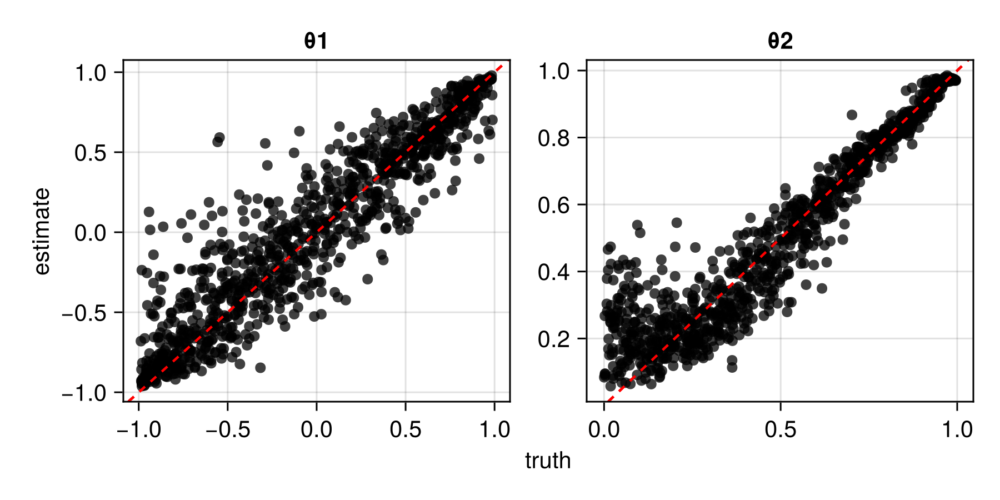
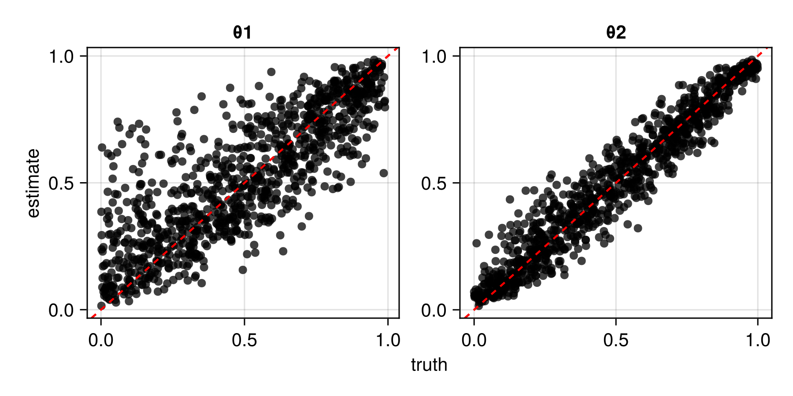
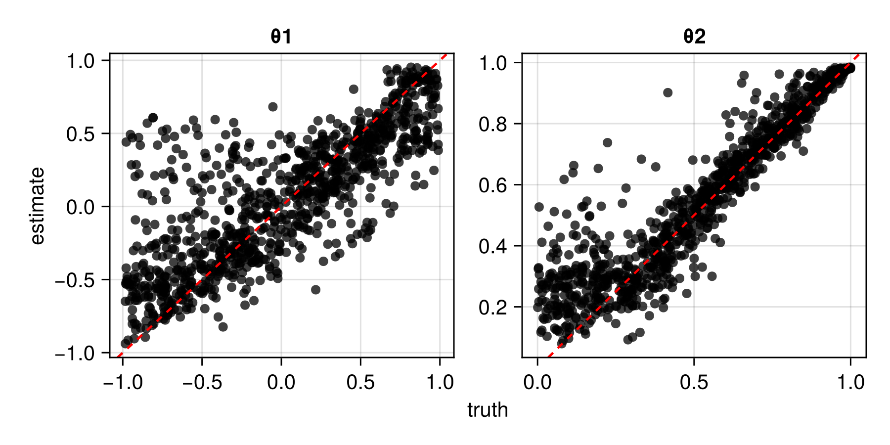
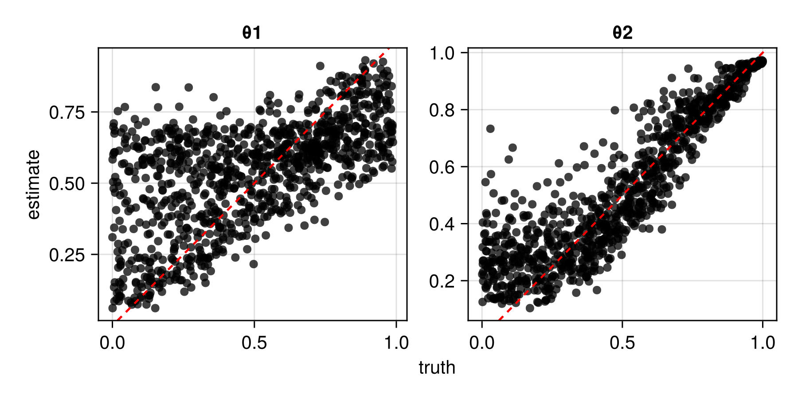

# Advanced usage

## Saving and loading neural estimators

In regards to saving and loading, neural estimators behave in the same manner as regular Flux models. Therefore, the examples and recommendations outlined in the [Flux documentation](https://fluxml.ai/Flux.jl/stable/guide/saving/) also apply directly to neural estimators. For example, to save the model state of the neural estimator `estimator`, run:

```julia
using Flux
using BSON: @save, @load
model_state = Flux.state(estimator)
@save "estimator.bson" model_state
```

Then, to load it in a new session, one may initialise a neural estimator with the same architecture used previously, and load the saved model state as follows:

```julia
@load "estimator.bson" model_state
Flux.loadmodel!(estimator, model_state)
```

It is also straightforward to save the entire neural estimator, including its architecture (see [here](https://fluxml.ai/Flux.jl/stable/guide/saving/#Saving-Models-as-Julia-Structs)). However, the first approach outlined above is recommended for long-term storage.

For convenience, the function [`train()`](@ref) allows for the automatic saving of the model state during the training stage, via the argument `savepath`.

## Storing expensive intermediate objects for data simulation

Parameters sampled from the prior distribution may be stored in two ways. Most simply, they can be stored as a $d \times K$ matrix, where $d$ is the number of parameters in the model and $K$ is the number of parameter vectors sampled from the prior distribution. Alternatively, they can be stored in a user-defined subtype of [`ParameterConfigurations`](@ref), whose only requirement is a field `θ` that stores the $d \times K$ matrix of parameters. With this approach, one may store computationally expensive intermediate objects, such as Cholesky factors, for later use when conducting "on-the-fly" simulation, which is discussed below.

## On-the-fly and just-in-time simulation

When data simulation is (relatively) computationally inexpensive, the training data set, $\mathcal{Z}_{\text{train}}$, can be simulated continuously during training, a technique coined "simulation-on-the-fly". Regularly refreshing $\mathcal{Z}_{\text{train}}$ leads to lower out-of-sample error and to a reduction in overfitting. This strategy therefore facilitates the use of larger, more representationally-powerful networks that are prone to overfitting when $\mathcal{Z}_{\text{train}}$ is fixed. Further, this technique allows for data to be simulated "just-in-time", in the sense that they can be simulated in small batches, used to train the neural estimator, and then removed from memory. This can substantially reduce pressure on memory resources, particularly when working with large data sets.

One may also regularly refresh the set $\vartheta_{\text{train}}$ of parameter vectors used during training, and doing so leads to similar benefits. However, fixing $\vartheta_{\text{train}}$ allows computationally expensive terms, such as Cholesky factors when working with Gaussian process models, to be reused throughout training, which can substantially reduce the training time for some models. Hybrid approaches are also possible, whereby the parameters (and possibly the data) are held fixed for several epochs (i.e., several passes through the training set when performing stochastic gradient descent) before being refreshed.

The above strategies are facilitated with various methods of [`train()`](@ref).


## Regularisation

The term *regularisation* refers to a variety of techniques aimed to reduce overfitting when training a neural network, primarily by discouraging complex models.

A popular regularisation technique is known as dropout, implemented in Flux's [`Dropout`](https://fluxml.ai/Flux.jl/stable/models/layers/#Flux.Dropout) layer. Dropout involves temporarily dropping ("turning off") a randomly selected set of neurons (along with their connections) at each iteration of the training stage, which results in a computationally-efficient form of model (neural-network) averaging [(Srivastava et al., 2014)](https://jmlr.org/papers/v15/srivastava14a.html).

Another class of regularisation techniques involve modifying the loss function. For instance, L₁ regularisation (sometimes called lasso regression) adds to the loss a penalty based on the absolute value of the neural-network parameters. Similarly, L₂ regularisation (sometimes called ridge regression) adds to the loss a penalty based on the square of the neural-network parameters. Note that these penalty terms are not functions of the data or of the statistical-model parameters that we are trying to infer. These regularisation techniques can be implemented straightforwardly by providing a custom `optimiser` to [`train()`](@ref) that includes a [`SignDecay`](https://fluxml.ai/Flux.jl/stable/reference/training/optimisers/#Optimisers.SignDecay) object for L₁ regularisation, or a [`WeightDecay`](https://fluxml.ai/Flux.jl/stable/reference/training/optimisers/#Optimisers.WeightDecay) object for L₂ regularisation. See the [Flux documentation](https://fluxml.ai/Flux.jl/stable/guide/training/training/#Regularisation) for further details. Note that, when the training data and parameters are simulated dynamically (i.e., "on the fly"; see [On-the-fly and just-in-time simulation](@ref)), overfitting is generally not a concern, making this form of regularisation unnecessary.

For illustration, the following code constructs a neural Bayes estimator using dropout and L₁ regularisation with penalty coefficient $\lambda = 10^{-4}$:

```julia
using NeuralEstimators, Flux

# Data Z|θ ~ N(θ, 1) with θ ~ N(0, 1)
d = 1     # dimension of the parameter vector θ
n = 1     # dimension of each independent replicate of Z
m = 5     # number of independent replicates in each data set
sampler(K) = randn32(d, K)
simulator(θ, m) = [μ .+ randn32(n, m) for μ ∈ eachcol(θ)]
K = 3000  # number of training samples
θ_train = sampler(K)
θ_val   = sampler(K)
Z_train = simulator(θ_train, m)
Z_val   = simulator(θ_val, m)

# Neural network with dropout layers
w = 128
ψ = Chain(Dense(1, w, relu), Dropout(0.1), Dense(w, w, relu), Dropout(0.5))     
ϕ = Chain(Dense(w, w, relu), Dropout(0.5), Dense(w, 1))           
network = DeepSet(ψ, ϕ)

# Initialise estimator
estimator = PointEstimator(network)

# Optimiser with L₁ regularisation
optimiser = Flux.setup(OptimiserChain(SignDecay(1e-4), Adam()), estimator)

# Train the estimator
train(estimator, θ_train, θ_val, Z_train, Z_val; optimiser = optimiser)
```

## Expert summary statistics

Implicitly, neural estimators involve the learning of summary statistics. However, some summary statistics are available in closed form, simple to compute, and highly informative (e.g., sample quantiles, the empirical variogram). Often, explicitly incorporating these expert summary statistics in a neural estimator can simplify the optimisation problem, and lead to a better estimator.

The fusion of learned and expert summary statistics is facilitated by our implementation of the [`DeepSet`](@ref) framework. Note that this implementation also allows the user to construct a neural estimator using only expert summary statistics, following, for example, [Gerber and Nychka (2021)](https://onlinelibrary.wiley.com/doi/abs/10.1002/sta4.382) and [Rai et al. (2024)](https://onlinelibrary.wiley.com/doi/abs/10.1002/env.2845). Note also that the user may specify arbitrary expert summary statistics, however, for convenience several standard [User-defined summary statistics](@ref) are provided with the package, including a fast, sparse approximation of the empirical variogram.

For an example of incorporating expert summary statistics, see [Irregular spatial data](@ref), where the empirical variogram is used alongside learned graph-neural-network-based summary statistics.

## Variable sample sizes

A neural estimator in the Deep Set representation can be applied to data sets of arbitrary size. However, even when the neural Bayes estimator approximates the true Bayes estimator arbitrarily well, it is conditional on the number of replicates, $m$, and is not necessarily a Bayes estimator for $m^* \ne m$. Denote a data set comprising $m$ replicates as $\boldsymbol{Z}^{(m)} \equiv (\boldsymbol{Z}_1', \dots, \boldsymbol{Z}_m')'$. There are at least two (non-mutually exclusive) approaches one could adopt if data sets with varying $m$ are envisaged, which we describe below.

### Piecewise estimators

If data sets with varying $m$ are envisaged, one could train $l$ estimators for different sample sizes, or groups thereof (e.g., a small-sample estimator and a large-sample estimator). For example, for sample-size changepoints $m_1$, $m_2$, $\dots$, $m_{l-1}$, one could construct a piecewise neural Bayes estimator,
```math
\hat{\boldsymbol{\theta}}(\boldsymbol{Z}^{(m)}; \boldsymbol{\gamma}^*)
=
\begin{cases}
\hat{\boldsymbol{\theta}}(\boldsymbol{Z}^{(m)}; \boldsymbol{\gamma}^*_{\tilde{m}_1}) & m \leq m_1,\\
\hat{\boldsymbol{\theta}}(\boldsymbol{Z}^{(m)}; \boldsymbol{\gamma}^*_{\tilde{m}_2}) & m_1 < m \leq m_2,\\
\quad \vdots \\
\hat{\boldsymbol{\theta}}(\boldsymbol{Z}^{(m)}; \boldsymbol{\gamma}^*_{\tilde{m}_l}) & m > m_{l-1},
\end{cases}
```
where $\boldsymbol{\gamma}^* \equiv (\boldsymbol{\gamma}^*_{\tilde{m}_1}, \dots, \boldsymbol{\gamma}^*_{\tilde{m}_{l-1}})$, and $\boldsymbol{\gamma}^*_{\tilde{m}}$ are the neural-network parameters optimised for sample size $\tilde{m}$ chosen so that $\hat{\boldsymbol{\theta}}(\cdot; \boldsymbol{\gamma}^*_{\tilde{m}})$ is near-optimal over the range of sample sizes in which it is applied. This approach works well in practice and is less computationally burdensome than it first appears when used in conjunction with the technique known as pre-training (see [Sainsbury-Dale at al., 2024](https://www.tandfonline.com/doi/full/10.1080/00031305.2023.2249522), Sec 2.3.3), which is facilitated with [`trainx()`](@ref). 

Piecewise estimators are implemented using the type [`PiecewiseEstimator`](@ref). 

### Training with variable sample sizes

Alternatively, one could treat the sample size as a random variable, $M$, with support over a set of positive integers, $\mathcal{M}$, in which case the Bayes risk becomes
```math
\sum_{m \in \mathcal{M}}
\textrm{Pr}(M=m)\left(
\int_\Theta \int_{\mathcal{Z}^m}  L(\boldsymbol{\theta}, \hat{\boldsymbol{\theta}}(\boldsymbol{Z}^{(m)}))p(\boldsymbol{Z}^{(m)} \mid \boldsymbol{\theta})\pi(\boldsymbol{\theta}) \textrm{d}\boldsymbol{Z}^{(m)} \textrm{d} \boldsymbol{\theta}
\right).
```
This approach does not materially alter the workflow, except that one must also sample the number of replicates before simulating the data during the training phase.

The following pseudocode illustrates how one may modify a general data simulator to train under a range of sample sizes, with the distribution of $M$ defined by passing any object that can be sampled using `rand(m, K)` (e.g., an integer range like `1:30`, or an integer-valued distribution from [Distributions.jl](https://juliastats.org/Distributions.jl/stable/univariate/)):

```julia
# Method that allows m to be an object that can be sampled from
function simulate(parameters, m)
	# Number of parameter vectors stored in parameters
	K = size(parameters, 2)

	# Generate K sample sizes from the prior distribution for M
	m̃ = rand(m, K)

	# Pseudocode for data simulation
	Z = [<simulate m̃[k] realisations from the model> for k ∈ 1:K]

	return Z
end

# Method that allows an integer to be passed for m
simulate(parameters, m::Integer) = simulate(parameters, range(m, m))
```


## Missing data

Neural networks do not naturally handle missing data, and this property can preclude their use in a broad range of applications. Here, we describe two techniques that alleviate this challenge in the context of parameter point estimation: the [masking approach](@ref "The masking approach") and the [expectation-maximisation (EM) approach](@ref "The EM approach"). 

As a running example, we consider a Gaussian process model where the data are collected over a regular grid, but where some elements of the grid are unobserved. This situation often arises in, for example, remote-sensing applications, where the presence of cloud cover prevents measurement in some places. Below, we load the packages needed in this example, and define some aspects of the model that will remain constant throughout (e.g., the prior, the spatial domain). We also define types and functions for sampling from the prior distribution and for simulating marginally from the data model.

```julia
using NeuralEstimators, Flux
using Distributions: Uniform
using Distances, LinearAlgebra
using Statistics: mean

# Prior and dimension of parameter vector
Π = (τ = Uniform(0, 1.0), ρ = Uniform(0, 0.4))
d = length(Π)

# Define the grid and compute the distance matrix
points = range(0, 1, 16)
S = expandgrid(points, points)
D = pairwise(Euclidean(), S, dims = 1)

# Collect model information for later use
ξ = (Π = Π, S = S, D = D)

# Struct for storing parameters and Cholesky factors
struct Parameters <: ParameterConfigurations
	θ
	L
end

# Constructor for above struct
function sample(K::Integer, ξ)

	# Sample parameters from the prior
	Π = ξ.Π
	τ = rand(Π.τ, K)
	ρ = rand(Π.ρ, K)
	ν = 1 # fixed smoothness

	# Compute Cholesky factors  
	L = maternchols(ξ.D, ρ, ν)

	# Concatenate into matrix
	θ = permutedims(hcat(τ, ρ))

	Parameters(θ, L)
end

# Marginal simulation from the data model
function simulate(parameters::Parameters, m::Integer)

	K = size(parameters, 2)
	τ = parameters.θ[1, :]
	L = parameters.L
	G = isqrt(size(L, 1)) # side-length of grid

	Z = map(1:K) do k
		z = simulategaussian(L[:, :, k], m)
		z = z + τ[k] * randn(size(z)...)
		z = reshape(z, G, G, 1, :)
		z
	end

	return Z
end
```

### The masking approach

The first missing-data technique that we consider is the so-called masking approach of [Wang et al. (2024)](https://journals.plos.org/ploscompbiol/article?id=10.1371/journal.pcbi.1012184); see also the discussion by [Sainsbury-Dale et al. (2025, Sec. 2.2)](https://doi.org/10.48550/arXiv.2501.04330). The strategy involves completing the data by replacing missing values with zeros, and using auxiliary variables to encode the missingness pattern, which are also passed into the network.

Let $\boldsymbol{Z}$ denote the complete-data vector. Then, the masking approach considers inference based on $\boldsymbol{W}$, a vector of indicator variables that encode the missingness pattern (with elements equal to one or zero if the corresponding element of $\boldsymbol{Z}$ is observed or missing, respectively), and
```math
\boldsymbol{U} \equiv \boldsymbol{Z} \odot \boldsymbol{W},
```
where $\odot$ denotes elementwise multiplication and the product of a missing element and zero is defined to be zero. Irrespective of the missingness pattern, $\boldsymbol{U}$ and $\boldsymbol{W}$ have the same fixed dimensions and hence may be processed easily using a single neural network. A neural point estimator is then trained on realisations of $\{\boldsymbol{U}, \boldsymbol{W}\}$ which, by construction, do not contain any missing elements. 

The manner in which $\boldsymbol{U}$ and $\boldsymbol{W}$ are combined depends on the multivariate structure of the data and the chosen architecture. For example, when the data are gridded and the neural network is a CNN, then $\boldsymbol{U}$ and $\boldsymbol{W}$ can be concatenated along the channels dimension (i.e., the penultimate dimension of the array).  The construction of augmented data sets $\{\boldsymbol{U}, \boldsymbol{W}\}$ from incomplete data is facilitated by the helper function [`encodedata()`](@ref).

Since the missingness pattern $\boldsymbol{W}$ is now an input to the neural network, it must be incorporated during the training phase. When interest lies only in making inference from a single already-observed data set, $\boldsymbol{W}$ is fixed and known, and the Bayes risk remains unchanged. However, amortised inference, whereby one trains a single neural network that will be used to make inference with many data sets, requires a joint model for the data $\boldsymbol{Z}$ and the missingness pattern $\boldsymbol{W}$, which is here defined as follows (see the helper function [`removedata()`](@ref)):

```julia
# Marginal simulation from the data model and a MCAR missingness model
function simulatemissing(parameters::Parameters, m::Integer)

	Z = simulate(parameters, m)   # complete data

	UW = map(Z) do z
		prop = rand()             # sample a missingness proportion
		z = removedata(z, prop)   # randomly remove a proportion of the data
		uw = encodedata(z)        # replace missing entries with zero and encode missingness pattern
		uw
	end

	return UW
end
```

Next, we construct and train a masked neural Bayes estimator using a CNN architecture. Here, the first convolutional layer takes two input channels, since we store the augmented data $\boldsymbol{U}$ in the first channel and the missingness pattern $\boldsymbol{W}$ in the second. We construct a point estimator, but the masking approach is applicable with any other kind of estimator (see [Estimators](@ref)):

```julia
# Construct DeepSet object
ψ = Chain(
	Conv((10, 10), 2 => 16,  relu),
	Conv((5, 5),  16 => 32,  relu),
	Conv((3, 3),  32 => 64, relu),
	Flux.flatten
	)
ϕ = Chain(Dense(64, 256, relu), Dense(256, d, exp))
network = DeepSet(ψ, ϕ)

# Initialise point estimator
θ̂ = PointEstimator(network)

# Train the masked neural Bayes estimator
θ̂ = train(θ̂, sample, simulatemissing, m = 1, ξ = ξ, K = 1000, epochs = 10)
```

Once trained, we can apply our masked neural Bayes estimator to (incomplete) observed data. The data must be encoded in the same manner as during training. Below, we use simulated data as a surrogate for real data, with a missingness proportion of 0.25:

```julia
θ = sample(1, ξ)     # true parameters
Z = simulate(θ, 1)[1]    # complete data
Z = removedata(Z, 0.25)  # "observed" incomplete data (i.e., with missing values)
UW = encodedata(Z)       # augmented data {U, W}
θ̂(UW)                    # point estimate
```


### The EM approach

Let $\boldsymbol{Z}_1$ and $\boldsymbol{Z}_2$ denote the observed and unobserved (i.e., missing) data, respectively, and let $\boldsymbol{Z} \equiv (\boldsymbol{Z}_1', \boldsymbol{Z}_2')'$ denote the complete data. A classical approach to facilitating inference when data are missing is the expectation-maximisation (EM) algorithm. The *neural EM algorithm* ([Sainsbury-Dale et al., 2025](https://doi.org/10.48550/arXiv.2501.04330)) is an approximate version of the conventional (Bayesian) Monte Carlo EM algorithm which, at the $l$th iteration, updates the parameter vector through
```math
\boldsymbol{\theta}^{(l)} = \underset{\boldsymbol{\theta}}{\mathrm{arg\,max}} \sum_{h = 1}^H \ell(\boldsymbol{\theta};  \boldsymbol{Z}_1,  \boldsymbol{Z}_2^{(lh)}) + \log \pi_H(\boldsymbol{\theta}),
```
where realisations of the missing-data component, $\{\boldsymbol{Z}_2^{(lh)} : h = 1, \dots, H\}$, are sampled from the probability distribution of $\boldsymbol{Z}_2$ given $\boldsymbol{Z}_1$ and $\boldsymbol{\theta}^{(l-1)}$, and where $\pi_H(\boldsymbol{\theta}) \propto \{\pi(\boldsymbol{\theta})\}^H$ is a concentrated version of the original prior density. Given the conditionally simulated data, the neural EM algorithm performs the above EM update using a neural network that returns the MAP estimate (i.e., the posterior mode) using (complete) conditionally simulated data. 

First, we construct a neural approximation of the MAP estimator. In this example, we will take $H=50$. When $H$ is taken to be reasonably large, one may lean on the [Bernstein-von Mises](https://en.wikipedia.org/wiki/Bernstein%E2%80%93von_Mises_theorem) theorem to train the neural Bayes estimator under linear or quadratic loss; otherwise, one should train the estimator under a continuous relaxation of the 0--1 loss (e.g., the [`tanhloss()`](@ref) in the limit $\kappa \to 0$). This is done as follows:

```julia
# Construct DeepSet object
ψ = Chain(
	Conv((10, 10), 1 => 16,  relu),
	Conv((5, 5),  16 => 32,  relu),
	Conv((3, 3),  32 => 64, relu),
	Flux.flatten
	)
ϕ = Chain(
	Dense(64, 256, relu),
	Dense(256, d, exp)
	)
network = DeepSet(ψ, ϕ)

# Initialise point estimator
θ̂ = PointEstimator(network)

# Train neural Bayes estimator
H = 50
θ̂ = train(θ̂, sample, simulate, m = H, ξ = ξ, K = 1000, epochs = 10)
```

Next, we define a function for conditional simulation (see [`EM`](@ref) for details on the required format of this function):

```julia
function simulateconditional(Z::M, θ, ξ; nsims::Integer = 1) where {M <: AbstractMatrix{Union{Missing, T}}} where T

	# Save the original dimensions
	dims = size(Z)

	# Convert to vector
	Z = vec(Z)

	# Compute the indices of the observed and missing data
	I₁ = findall(z -> !ismissing(z), Z) # indices of observed data
	I₂ = findall(z -> ismissing(z), Z)  # indices of missing data
	n₁ = length(I₁)
	n₂ = length(I₂)

	# Extract the observed data and drop Missing from the eltype of the container
	Z₁ = Z[I₁]
	Z₁ = [Z₁...]

	# Distance matrices needed for covariance matrices
	D   = ξ.D # distance matrix for all locations in the grid
	D₂₂ = D[I₂, I₂]
	D₁₁ = D[I₁, I₁]
	D₁₂ = D[I₁, I₂]

	# Extract the parameters from θ
	τ = θ[1]
	ρ = θ[2]

	# Compute covariance matrices
	ν = 1 # fixed smoothness
	Σ₂₂ = matern.(UpperTriangular(D₂₂), ρ, ν); Σ₂₂[diagind(Σ₂₂)] .+= τ^2
	Σ₁₁ = matern.(UpperTriangular(D₁₁), ρ, ν); Σ₁₁[diagind(Σ₁₁)] .+= τ^2
	Σ₁₂ = matern.(D₁₂, ρ, ν)

	# Compute the Cholesky factor of Σ₁₁ and solve the lower triangular system
	L₁₁ = cholesky(Symmetric(Σ₁₁)).L
	x = L₁₁ \ Σ₁₂

	# Conditional covariance matrix, cov(Z₂ ∣ Z₁, θ),  and its Cholesky factor
	Σ = Σ₂₂ - x'x
	L = cholesky(Symmetric(Σ)).L

	# Conditonal mean, E(Z₂ ∣ Z₁, θ)
	y = L₁₁ \ Z₁
	μ = x'y

	# Simulate from the distribution Z₂ ∣ Z₁, θ ∼ N(μ, Σ)
	z = randn(n₂, nsims)
	Z₂ = μ .+ L * z

	# Combine the observed and missing data to form the complete data
	Z = map(1:nsims) do l
		z = Vector{T}(undef, n₁ + n₂)
		z[I₁] = Z₁
		z[I₂] = Z₂[:, l]
		z
	end
	Z = stackarrays(Z, merge = false)

	# Convert Z to an array with appropriate dimensions
	Z = reshape(Z, dims..., 1, nsims)

	return Z
end
```

Now we can use the neural EM algorithm to get parameter point estimates from data containing missing values. The algorithm is implemented with the type [`EM`](@ref). Again, here we use simulated data as a surrogate for real data:

```julia
θ = sample(1, ξ)            # true parameters
Z = simulate(θ, 1)[1][:, :]     # complete data
Z = removedata(Z, 0.25)         # "observed" incomplete data (i.e., with missing values)
θ₀ = mean.([Π...])              # initial estimate, the prior mean

neuralem = EM(simulateconditional, θ̂)
neuralem(Z, θ₀, ξ = ξ, nsims = H, use_ξ_in_simulateconditional = true)
```


## Censored data

Neural estimators can be constructed to handle censored data as input, by exploiting [The masking approach](@ref) described above in the context of missing data. For simplicity, here we describe inference with left censored data (i.e., where we observe only those data that exceed some threshold), but extensions to right or interval censoring are possible. 

[Richards et al. (2024)](https://jmlr.org/papers/v25/23-1134.html) discuss neural Bayes estimation from censored data in the context of peaks-over-threshold extremal dependence modelling, where artifical censoring of data is imposed to reduce estimation bias in the presence of marginally non-extreme events. For peaks-over-threshold models, observed data are treated as censored if they exceed their corresponding marginal $\tau$-quantile, for $\tau \in (0,1)$ close to one. We present two approaches to censoring data: a [General setting](@ref), where users specifiy their own deterministic "censoring", and [Peaks-over-threshold modelling](@ref), where users supply a (censoring) quantile level $\tau$, which can be treated as random and/or feature as an input to the neural network.

As a running example, we consider a bivariate random scale Gaussian mixture; see [Engelke, Opitz, and Wadsworth (2019)](https://link.springer.com/article/10.1007/s10687-019-00353-3) and [Huser and Wadsworth (2018)](https://www.tandfonline.com/doi/full/10.1080/01621459.2017.1411813). We consider the task of estimating $\boldsymbol{\theta}=(\rho,\delta)'$, for correlation parameter $\rho \in [0,1)$ and shape parameter $\delta \in [0,1]$. Data $\boldsymbol{Z}_1,\dots,\boldsymbol{Z}_m$ are independent and identically distributed according to the random scale construction
```math
\boldsymbol{Z}_i = \delta R_i + (1-\delta)  \boldsymbol{X}_i,
```
where $R_i \sim \text{Exp}(1)$ and $\boldsymbol{X}_i$ is a bivariate random vector following a Gaussian copula with correlation $\rho$ and unit exponential margins. We note that the vector $\boldsymbol{Z}_i$ does not itself have unit exponential margins; instead, its marginal distribution function, $F(z;\delta),$ is dependent on $\delta$; this has a closed form expression, see [Huser and Wadsworth (2018)](https://www.tandfonline.com/doi/full/10.1080/01621459.2017.1411813).

Simulation of the random scale mixture and its marginal ditribution function are provided below.
```julia
# Libraries used throughout this example
using NeuralEstimators, Flux
using Folds
using LinearAlgebra: Symmetric, cholesky
using Distributions: cdf, Uniform, Normal
using AlgebraOfGraphics, CairoMakie   

# Sampling θ from the prior distribution
function sample(K)
	ρ = rand(Uniform(0.0, 0.99), K)
	δ = rand(Uniform(0.0, 1.0), K)
	return vcat(ρ', δ')
end

# Marginal simulation of Z | θ
function simulate(θ, m) 
	Z = Folds.map(1:size(θ, 2)) do k
		ρ = θ[1, k]
		δ = θ[2, k]
		Σ = [1 ρ; ρ 1]
		L = cholesky(Symmetric(Σ)).L
		X = L * randn(2, m)                 # Standard Gaussian margins
		X = cdf.(Normal(), X)               # Transform to uniform margins
		X = -log.(1 .- X)                   # Transform to unit exponential margins
		R = -log.(1 .- rand(1, m))         
		z = δ .* R .+ (1 - δ) .* X
		z
	end
	return Z
end

# Marginal distribution function; see Huser and Wadsworth (2018)
function F(z; δ)
	if δ == 0.5 
        u = 1 .- exp.(- 2 .* z) .* (1 .+ 2 .* z) 
    else 
        u = 1 .- (δ ./ (2 .* δ .- 1)) .* exp.(- z ./ δ) .+ ((1 .- δ) ./ (2 * δ .- 1)) .* exp.( - z ./ (1 - δ)) 
    end
	return u
end
```


### General setting

Let $\boldsymbol{Z} \equiv (\boldsymbol{Z}_1', \dots, \boldsymbol{Z}_m')'$ denote the complete-data vector. In the general censoring setting, a user must provide a function `censorandaugment()` that constructs, from $\boldsymbol{Z}$, augmented data $\boldsymbol{A}=(\tilde{\boldsymbol{Z}}, \boldsymbol{W}')'$. Similarly to [The masking approach](@ref) for missing data, we consider inference using a vector of indicator variables that encode the censoring pattern, denoted by $\boldsymbol{W}$. Here $\boldsymbol{W}$ has elements equal to one or zero if the corresponding element of $\boldsymbol{Z}$ is left censored or observed, respectively; that is, ${W}_j=1$ if ${Z}_j  \leq c_j$ (and $W_j=0$, otherwise), where $c_j$ is a specified censoring threshold. Unlike typical masking, we do not set censored values to `missing`; we instead construc a new vector $\tilde{\boldsymbol{Z}}$, which comprises the vector $\boldsymbol{Z}$ with its censored values set to some pre-specified constant, contained within the vector $\boldsymbol{\zeta}$, such that

```math
\tilde{\boldsymbol{Z}} \equiv \boldsymbol{Z} \odot \boldsymbol{W} + \boldsymbol{\zeta} \odot ( \boldsymbol{1} - \boldsymbol{W}),
```
where $\boldsymbol{1}$ is a vector of ones (of equivalent dimension to $\boldsymbol{W}$) and where $\odot$ denotes elementwise multiplication. Note that $\boldsymbol{\zeta}$ and the censoring pattern can differ across replicates $t=1,\dots,m$, as well as the underlying model parameter values.

The augmented data $\boldsymbol{A}$ is an input to the neural network, and so the inner neural network $\boldsymbol{\psi}$ should be designed appropriately. The manner in which concatenation of $\tilde{\boldsymbol{Z}}$ and $\boldsymbol{W}$ is performed may differ depending on the type of the first layer used in $\boldsymbol{\psi}$. For example, if using a `Dense` layer, one may concatenate $\tilde{\boldsymbol{Z}}$ and $\boldsymbol{W}$ along the first dimension (as they are both matrices; in this case, with dimension ($2,m$)); if using graph or `Conv` layers, $\tilde{\boldsymbol{Z}}$ and $\boldsymbol{W}$ should be concatenated as if they were two separate channels in a graph/image (see [`encodedata()`](@ref)).

Note that the function `censorandaugment()` should be applied to data during both training and at evaluation time. Any manipulation of data that is performed during simulation of the training data should also be performed to data at test time. Below, the function `censorandaugment()` takes in a vector of censoring levels $\boldsymbol{c}$ of the same length as $\boldsymbol{Z}_i$, and sets censored values to $\zeta_1=\dots=\zeta_m=\zeta$. In this way, the censoring mechanism and augmentation values, $\boldsymbol{\zeta}$, do not vary with the model parameter values or with the replicate index.

```julia
function censorandaugment(z; c, ζ = 0)
    I = 1 * (z .<= c)
    z = ifelse.(z .<= c, ζ, z)
    return vcat(z, I)
end
```

Censoring is performed during training. To ensure this, we use `censorandaugment()` within the simulation function:

```julia
# Marginal simulation of censored data
function simulatecensored(θ, m; c, ζ) 
	Z = simulate(θ, m)
	A = Folds.map(Z) do Zₖ
		mapslices(Z -> censorandaugment(Z, c = c, ζ = ζ), Zₖ, dims = 1)
	end
	return A
end

# Generate censored data, with values below 0.5 censored and set to ζ = -1.
K = 1000       # number of training samples
c = [0.5, 0.5] # censoring thresholds
m = 200        # number of independent replicates in each data set
θ_train = sample(K)
Z_train = simulatecensored(θ_train, m; c = c, ζ = -1.0)
```

To construct a point estimator which can accomodate the augmented dataset, we ensure that the dimension of the input layer is $2d$, where $d$ is the number of parameters. Below, we construct and train a point estimator for the generated censored data.

```julia
d = 2   # dimension of θ
w = 128  # width of each hidden layer

# DeepSet neural network, with the final layer of ϕ enforcing ρ, δ ∈ (0,1)
final_layer = Dense(w, d, sigmoid)      
ψ = Chain(Dense(d * 2, w, relu), Dense(w, w, relu))    
ϕ = Chain(Dense(w, w, relu), final_layer)           
network = DeepSet(ψ, ϕ)

# Construct the estimator
θ̂_cNBE = PointEstimator(network)
```

We now train and test two estimators for censored data; one with `c = [0, 0]` and one with `c = [0.5, 0.5]`, which correspond to no and mild censoring, respectively. We assess the estimators using the same test data. As expected, the neural estimator designed for non-censored data has lower sampling uncertainty, as the data it uses are more informative.


```julia
# Training and assessment
θ_test = sample(1000) # test parameter values

# With no censoring
simulator(θ, m) = simulatecensored(θ, m; c = [0, 0], ζ = -1.0) 
θ̂_cNBE1 = train(θ̂_cNBE, sample, simulator, m = m)
Z_test1 = simulatecensored(θ_test, m; c = [0, 0], ζ = -1.0) 
assessment1 = assess(θ̂_cNBE1, θ_test, Z_test1)   

# With mild censoring
simulator(θ, m) = simulatecensored(θ, m; c = [0.5, 0.5], ζ = -1.0) 
θ̂_cNBE2 = train(θ̂_cNBE, sample, simulator, m = m)
Z_test2 = simulatecensored(θ_test, m; c = [0.5, 0.5], ζ = -1.0) 
assessment2 = assess(θ̂_cNBE2, θ_test, Z_test2)   

figure1 = plot(assessment1)
figure2 = plot(assessment2)
```




Note that the estimators are not amortised with respect to the censoring scheme, and a new estimator must be built and trained if the censoring scheme changes. However, amortisation with respect to the censoring scheme is possible if we specify a parameterised censoring scheme; one such scheme features in [Peaks-over-threshold modelling](@ref).

### Peaks-over-threshold modelling

For peak-over-threshold modelling, the data censoring mechanism is determined by a user-specified quantile level $\tau$, which is typically taken to be close to one. During inference, artificial censoring is imposed: data that do not exceed their marginal $\tau$-quantile are treated as left censored. For the running example, we censor components of $\boldsymbol{Z}_i$ below the $\tau$-quantile of the marginal distribution of the random scale mixture, i.e., $F^{-1}(\tau; \delta)$.

Peaks-over-threshold modelling, with $\tau$ fixed, can be easily implemented by adapting the `censorandaugment()` function in [General setting](@ref), i.e., by imposing that `c` is an evaluation of $F^{-1}(\tau; \delta)$. However, [Richards et al. (2024)](https://jmlr.org/papers/v25/23-1134.html) show that one can amortise a point estimator with respect to the choice of $\tau$, by treating $\tau$ as random and allowing it to feature as an input into the outer neural network, $\boldsymbol{\phi}$. Note that, in this setting, the estimator cannot be trained via `simulation-on-the-fly`, and a finite number of $K$ data/parameter pairs must be sampled prior to training.

We also follow [Richards et al. (2024)](https://jmlr.org/papers/v25/23-1134.html) and consider inference for data on standardised margins; we pre-standardise data $\boldsymbol{Z}$ to have unit exponential margins, rather than $\delta$-dependent margins. This can help to improve the numerical stability of estimator training, as well as increasing training efficiency.

```julia
# Sampling τ from its prior
function sampleτ(K)
	τ = rand(Uniform(0.7, 0.9), 1, K) 
    return τ
end

# Adapt the censored data simulation to allow for τ as an input
function simulatecensored(θ, τ, m;  ζ) 

    Z = simulate(θ, m)
	K = size(θ, 2)

	A = Folds.map(1:K) do k
        Zₖ = Z[k]
        τₖ = τ[k]
		δₖ = θ[2, k]

        # Transform to Uniform margins.
        Z̃ₖ = F.(Zₖ; δ = δₖ)

        Z̃ₖ = - log.(1 .- Z̃ₖ) # Unit exponential margins; H^-1() in Richards et al., 2024
        c = - log(1 - τₖ) # Evaluate censoring quantile on exponential scale

        # Censor data and create augmented datasest
        A =  mapslices(Z -> censorandaugment(Z, c = c, ζ = ζ), Z̃ₖ, dims = 1)
        A 

	end

    return A
end

# Generate the data used for training and validation
K = 10000   # number of training samples
m = 1000    # number of independent replicates in each data set
θ_train  = sample(K)
θ_val    = sample(K)
τ_train  = sampleτ(K)
τ_val    = sampleτ(K)
Z_train  = simulatecensored(θ_train, τ_train, m;  ζ = -1.0)
Z_val    = simulatecensored(θ_val, τ_val, m;  ζ = -1.0)
```

As $\tau$ is now an input into the outer neural network of the DeepSet estimator, we must increase the input dimension of $\boldsymbol{\phi}$ (by one) when designing the neural estimator architecture. Below, we construct and train such an estimator.

```julia
# Construct DeepSet neural network
ψ = Chain(Dense(d * 2, w, relu), Dense(w, w, relu))    
ϕ = Chain(Dense(w + 1, w, relu), Dense(w, d, sigmoid))
network = DeepSet(ψ, ϕ)

# Initialise estimator
θ̂_τ = PointEstimator(network)

# Training
θ̂_τ = train(θ̂_τ, θ_train, θ_val, (Z_train, τ_train), (Z_val, τ_val))
```

We use our trained estimator for any specified and fixed value of $\tau$ within the support of its prior (in this case, [0.7,0.9]). Our trained estimator is amortised with respect to $\tau$; we do not need to retrain the estimator for different degrees of censoring.

We can assess the estimator for different values of $\tau$, corresponding to different amounts of censoring (larger $\tau$ corresponds to more censoring). As expected, estimation from data with less censoring (lower $\tau$) suffers from lower uncertainty.
```julia
# assessment with τ fixed to 0.75
τ_test =  repeat([0.75], 1000)'
Z_test = simulatecensored(θ_test, τ_test, m;  ζ = -1.0)

assessment_tau1 = assess(θ̂_τ, θ_test, (Z_test, τ_test))    
figure3 = plot(assessment_tau1)

# assessment with τ fixed to 0.9. Note that we do not retrain the estimator.
τ_test =  repeat([0.9], 1000)'
Z_test = simulatecensored(θ_test, τ_test, m;  ζ = -1.0)
                        
assessment_tau2 = assess(θ̂_τ, θ_test, (Z_test, τ_test))    
figure4 = plot(assessment_tau2)
```


