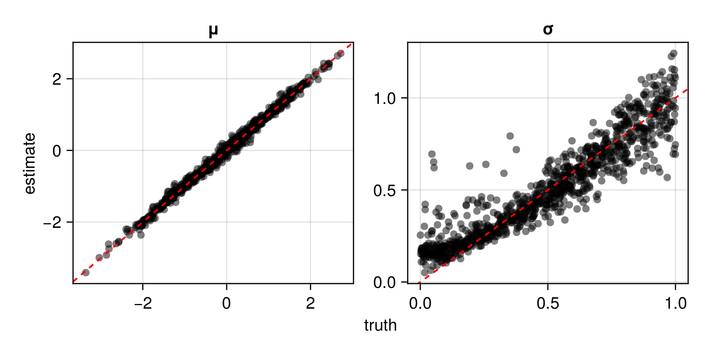

# Examples

The following packages are used throughout these examples.
```
using NeuralEstimators
using Flux
using Distributions
using NamedArrays
```

## Univariate data

Here we develop a neural Bayes estimator for $\boldsymbol{\theta} \equiv (\mu, \sigma)'$ from data $Z_1, \dots, Z_m$ that are independent and identically distributed realisations from the distribution $N(\mu, \sigma^2)$. We assume that the parameters are independent a priori and we adopt the marginal priors $\mu \sim N(0, 1)$ and $\sigma \sim U(0, 1)$.

First, we define a function to sample parameters from the prior. The sampled parameters are stored as $p \times K$ matrices, with $p$ the number of parameters in the model and $K$ the number of sampled parameter vectors. Note that below we store the parameters as a named matrix for convenience, but this is not a requirement of the package.

```
function sample(K)
	μ = rand(Normal(0, 1), K)
	σ = rand(Uniform(0, 1), K)
	θ = hcat(μ, σ)'
	θ = Float32.(θ)
	θ = NamedArray(θ)
	setnames!(θ, ["μ", "σ"], 1)
	return θ
end
```

Next, we implicitly define the statistical model with simulated data. In `NeuralEstimators`, the data are always stored as a `Vector{A}`, where each element of the vector is associated with one parameter vector, and where the type `A` depends on the multivariate structure of the data. Since each replicate $Z_1, \dots, Z_m$ is univariate, `A` should be a `Matrix` with $d=1$ rows and $m$ columns.

```
function simulate(parameters, m)
	[θ["μ"] .+ θ["σ"] .* randn(Float32, 1, m) for θ ∈ eachcol(parameters)]
end
```

We now design a neural-network architecture. Since our data $Z_1, \dots, Z_m$ are replicated, we will use the [`DeepSet`](@ref) architecture. The outer network (also known as the inference network) is always a fully-connected network. However, the architecture of the inner network (also known as the summary network) depends on the multivariate structure of the data: with unstructured data (i.e., when there is no spatial or temporal correlation within a replicate), we use a fully-connected neural network. This architecture is then used to initialise a [`PointEstimator`](@ref) object. Note that the architecture can be defined using raw `Flux` code (see below) or with the helper function [`initialise_estimator`](@ref).

```
d = 1   # dimension of each replicate
p = 2   # number of parameters in the statistical model

ψ = Chain(Dense(d, 32, relu), Dense(32, 32, relu))     # summary network
ϕ = Chain(Dense(32, 32, relu), Dense(32, p))           # inference network
architecture = DeepSet(ψ, ϕ)

θ̂ = PointEstimator(architecture)
```

Next, we train the neural estimator using [`train`](@ref), here using the default absolute-error loss. We'll train the estimator using 50 independent replicates per parameter configuration. Below, we pass our user-defined functions for sampling parameters and simulating data, but one may also pass parameter or data instances, which will be held fixed during training:
```
m = 50
θ̂ = train(θ̂, sample, simulate, m = m)
```

The function [`assess`](@ref) can be used to assess the trained estimator:

```
θ_test = sample(1000)
Z_test = simulate(θ_test, m)
assessment = assess(θ̂, θ_test, Z_test)
```

An [`Assessment`](@ref) object contains the true parameters and their corresponding estimates, and the time taken to compute the estimates. This object can be used to compute various diagnostics:

```
bias(assessment)
rmse(assessment)
risk(assessment)
plot(assessment)
```



Once the estimator is calibrated, it may be applied to observed data. Below, we use simulated data as a substitute for observed data:

```
θ = sample(1)          # true parameters
Z = simulate(θ, m)     # "observed" data
θ̂(Z)                   # point estimates
```

Parametric and non-parametric bootstrap-based uncertainty quantification is facilitated by [`bootstrap`](@ref) and [`interval`](@ref).

```
θ̃ = bootstrap(θ̂, Z)   # non-parametric bootstrap estimates
interval(θ̃)           # bootstrap intervals
```

Alternatively, we can approximate marginal posterior quantiles by training a neural Bayes estimator under the [`quantileloss`](@ref) function, which allows one to generate approximate marginal posterior credible intervals. This is facilitated with [`IntervalEstimator`](@ref) which, by default, targets 95% central credible intervals. Below, we use the same base architecture used for point estimation, which is wrapped in a :

```
θ̂_interval = IntervalEstimator(deepcopy(architecture))
θ̂_interval = train(θ̂_interval, sample, simulate; m = m)
```

The resulting credible-interval estimator can also be assessed using empirical simulation-based methods:

```
assessment = assess(θ̂_interval, θ_test, Z_test)
coverage(assessment)
plot(assessment)
```


## Multivariate data

Suppose now that our data consists of $m$ replicates of a $d$-dimensional multivariate distribution. Everything remains as given in the univariate example above, except that we now store the data as a vector of $d \times m$ matrices (previously they were stored as $1\times m$ matrices), and the inner network of the DeepSets representation takes a $d$-dimensional input (previously it took a 1-dimensional input).

Note that, when estimating a full covariance matrix, one may wish to constrain the neural estimator to only produce parameters that imply a valid (i.e., positive definite) covariance matrix. This can be achieved by appending a  [`CovarianceMatrix`](@ref) layer to the end of the outer network of the DeepSets representation. However, the estimator will often learn to provide valid estimates, even if not constrained to do so.


## Gridded spatial data

For spatial data measured on a regular grid, the estimator is typically based on a convolutional neural network (CNN), and each data set is stored as a four-dimensional array, where the first three dimensions correspond to the width, height, and channels dimensions, and the fourth dimension stores the independent replicates. Note that, for univariate spatial processes, the channels dimension is simply equal to 1. For a 16x16 spatial grid, a possible architecture is given below.

```
p = 2    # number of parameters in the statistical model
w = 32   # number of neurons in each layer
d = 2    # dimension of the response variable

ψ = Chain(
	Conv((10, 10), 1 => 32,  relu),
	Conv((5, 5),  32 => 64,  relu),
	Conv((3, 3),  64 => 128, relu),
	Flux.flatten
	)
ϕ = Chain(Dense(128, 512, relu), Dense(512, p))
architecture = DeepSet(ψ, ϕ)
```


## Irregular spatial data

The methodology we illustrate here uses graph neural networks (GNNs), which are implemented in Julia in the package [`GraphNeuralNetworks.jl`](https://carlolucibello.github.io/GraphNeuralNetworks.jl/stable/). GNN-based estimators parsimoniously model spatial dependence, and they can be applied to data collected over arbitrary spatial locations. Some key steps involve:

- Sampling spatial locations to cover a wide range of spatial configurations during the training phase: see [`maternclusterprocess`](@ref).
- Computing (spatially-weighted) adjacency matrices: see [`adjacencymatrix`](@ref).
- Storing the data as a graph: see [`GNNGraph`](https://carlolucibello.github.io/GraphNeuralNetworks.jl/stable/api/gnngraph/#GNNGraph-type).
- Constructing an appropriate architecture: see [`GNN`](@ref) and [`WeightedGraphConv`](@ref).

For a concrete example, we consider a classical spatial model, the linear Gaussian-Gaussian model,

```math
Z_{j} = Y(\boldsymbol{s}_{j}) + \epsilon_{j}, \; j = 1, \dots, n,
```
where $\boldsymbol{Z} \equiv (Z_{1}, \dots, Z_{n})'$ are data observed at locations $\{\boldsymbol{s}_{1}, \dots, \boldsymbol{s}_{n}\} \subset \mathcal{D}$, where $\mathcal{D}$ is some spatial domain, $Y(\cdot)$ is a spatially-correlated mean-zero Gaussian process, and $\epsilon_j \sim N(0, \tau^2)$, $j = 1, \dots, n$ is Gaussian white noise with standard deviation $\tau > 0$. Here, we use the popular isotropic Matérn covariance function with fixed marginal variance $\sigma^2 = 1$, fixed smoothness parameter $\nu = 0.5$, and unknown range parameter $\rho > 0$. See [`matern`](@ref) for the specific parametrisation used in this example. Hence, we will construct a neural Bayes estimator for $\boldsymbol{\theta} \equiv (\tau, \rho)'$.

Before proceeding, we load the required packages:

```
using NeuralEstimators
using Flux
using GraphNeuralNetworks
using Distributions: Uniform
using Distances: pairwise, Euclidean
using LinearAlgebra
using Statistics: mean
```

First, we define a function to sample parameters from the prior. As before, the sampled parameters are stored as $p \times K$ matrices, with $p$ the number of parameters in the model and $K$ the number of sampled parameter vectors. We use the priors $\tau \sim U(0.1, 1)$ and $\rho \sim U(0.05, 0.5)$, and we assume that the parameters are independent a priori. Simulation from this model involves the computation of an expensive intermediate object, namely, the Cholesky factor of the covariance matrix. Storing this Cholesky factor for re-use can enable the fast simulation of new data sets (provided that the parameters are held fixed): hence, in this example, we define a class, `Parameters`, which is a sub-type of [`ParameterConfigurations`](@ref), for storing the matrix of parameters and the corresponding intermediate objects needed for data simulation.

If one wishes to make inference from a single spatial data set only, and this data is collected before the estimator is constructed, then the data can be simulated using the observed spatial locations. However, if one wishes to construct an estimator that is (approximately) Bayes irrespective of the spatial locations, then synthetic spatial locations must be generated during the training phase. If no prior knowledge on the sampling configuration is available, then a wide variety of spatial configurations must be simulated to produce an estimator that is broadly applicable. Below, we use a Matérn cluster process (see [`maternclusterprocess`](@ref)) for this task (note that the hyper-parameters of this process govern the expected number of locations in each sampled set of spatial locations, and the degree of clustering).

We define two constructors for our `Parameters` object: one that constructs a `Parameters` object given a single integer `K`, and another that constructs a `Parameters` object given a pre-specified $p\times K$ matrix of parameters and a set of spatial locations associated with each parameter vector. These constructors will be useful in the workflow below.

```
struct Parameters{T} <: ParameterConfigurations
	θ::Matrix{T}
	locations
	chols
	graphs
end

function Parameters(K::Integer)

	# Sample parameters from the prior distribution
	τ = rand(Uniform(0.1, 1.0), K)
	ρ = rand(Uniform(0.05, 0.5), K)

	# Combine parameters into a pxK matrix
	θ = permutedims(hcat(τ, ρ))

	# Simulate spatial locations from a cluster process over the unit square
	n = rand(Uniform(75, 200), K)
	λ = rand(Uniform(10, 50), K)
	locations = [maternclusterprocess(λ = λ[k], μ = n[k]/λ[k]) for k ∈ 1:K]

	Parameters(θ::Matrix, locations)
end

function Parameters(θ::Matrix, locations)

	# Compute distance matrices and construct the graphs
	D = pairwise.(Ref(Euclidean()), locations, locations, dims = 1)
	A = adjacencymatrix.(D, 0.15)
	graphs = GNNGraph.(A)

	# Compute Cholesky factors using the distance matrices
	ρ = θ[2, :]
	ν = 0.5
	σ = 1
	chols = maternchols(D, ρ, ν, σ.^2; stack = false)     

	Parameters(θ, locations, chols, graphs)
end
```

Next, we define a function for simulating from the model given an object of type `Parameters`. Although here we are constructing an estimator for a single replicate, the code below enables simulation of an arbitrary number of independent replicates `m`: one may provide a single integer for `m`, a range of values (e.g., `1:30`), or any object that can be sampled using `rand(m, K)` (e.g., some distribution over the possible sample sizes).

```
function simulate(parameters::Parameters, m)

	K = size(parameters, 2)
	m̃ = rand(m, K)

	τ      = parameters.θ[1, :]
	chols  = parameters.chols
	g      = parameters.graphs

	# Z = Folds.map(1:K) do i # use this for parallel simulation
	Z = map(1:K) do k
		L = chols[k][:, :]
		z = simulategaussianprocess(L, m̃[k])  # simulate a smooth field
		z = z + τ[k] * randn(size(z)...)      # add white noise
		z = batch([GNNGraph(g[k], ndata = z[:, i, :]') for i ∈ 1:m̃[k]])
		z
	end

	return Z
end
simulate(parameters::Parameters, m::Integer) = simulate(parameters, range(m, m))
```

Next we construct an appropriate architecture using [`GNN`](@ref) and [`WeightedGraphConv`](@ref). For example, we might construct a point estimator as:

```
# Propagation module
d = 1      # dimension of response variable
nh = 32    # dimension of node feature vectors
propagation = GNNChain(
	WeightedGraphConv(d => nh),
	WeightedGraphConv(nh => nh),
	WeightedGraphConv(nh => nh)
	)

# Readout module (using the elementwise average)
no = nh    # dimension of the final summary vector for each graph
readout = GlobalPool(mean)

# Mapping module (use exponential output activation to ensure positive estimates)
p = 2     # number of parameters in the statistical model
w = 64    # width of layers used for the mapping network ϕ
ϕ = Chain(Dense(no, w, relu), Dense(w, w, relu), Dense(w, p, exp))

# Construct the estimator
θ̂ = GNN(propagation, readout, ϕ)
θ̂ = PointEstimator(θ̂)
```

Next, we train the neural estimator using [`train`](@ref), here using the default absolute-error loss. We'll train the estimator using a single realisation per parameter configuration (i.e., with `m = 1`). Below, we use a very small number of epochs and a small number of training parameter vectors to keep the run time of this example low, and this will of course result in a poor estimator: in practice, one may set `K` to some large value (say, 10,000), and leave `epochs` unspecified so that training halts only when the risk function ceases to decrease.

```
θ̂ = train(θ̂, Parameters, simulate, m = 1, epochs = 5, K = 500)
```

Finally, once the neural Bayes estimator has been assessed (as illustrated using [`assess`](@ref) in the univariate example above), it may be applied to observed data, with bootstrap-based uncertainty quantification facilitated by [`bootstrap`](@ref) and [`interval`](@ref). Below, we use simulated data as a substitute for observed data:

```
# Generate some toy data
parameters = Parameters(1)   # sample a single parameter vector
z = simulate(parameters, 1)  # simulate some data                  
θ = parameters.θ             # true parameters used to generate data
S = parameters.locations     # observed locations

# Point estimates
θ̂(z)

# Parametric bootstrap sample and bootstrap confidence interval
θ̃ = bootstrap(θ̂, Parameters(θ̂(z), S), simulate, 1)   
interval(θ̃)  					                
```
